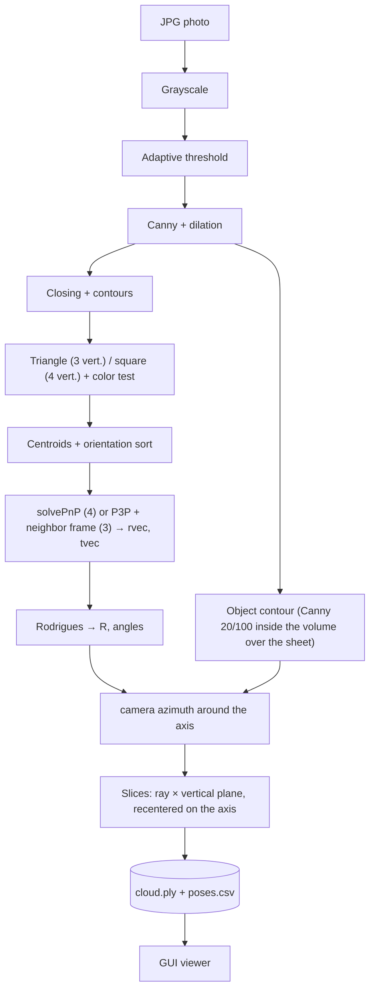

# 3D Reconstruction with OpenCV and Java

This work presents a prototype for the three-dimensional reconstruction of objects from a set of photographs captured around them, using only a conventional camera and an A4 sheet printed with a spatial reference marker. The original implementation was developed in Java with OpenCV 2.4 and later ported to version 4.9.

> This is the English version of the README. The Portuguese version (`README.md`) is the primary/canonical one; this file is a translation kept in sync with it.

<p align="center">
  
  
</p>
<p align="center"><em>Pair of images approximately 180° apart. T0/S0/T1/S1 denote the detected markers; the green rectangle is the model reprojected from the estimated pose; the axes X (red), Y (green) and Z (blue) indicate the marker's coordinate system.</em></p>

<p align="center"></p>

> As shown in the image above, the graphical interface brings together the main controls — "Process images" and "View" — along with tools for result analysis. The point cloud is assembled by **slices** (each contour is converted into a vertical plane rotated by the estimated camera angle), yielding a stable radius (dispersion of roughly 1 to 2 mm). The method is exact for solids of revolution and approximate for every other case. See [Results and limitations](#results-and-limitations).

## Contents

1. [Overview](#overview)
2. [The reference marker](#the-reference-marker)
3. [Process flowchart](#process-flowchart)
4. [Fundamentals: camera, calibration and pose](#fundamentals-camera-calibration-and-pose)
5. [From silhouette to 3D cloud (slices)](#from-silhouette-to-3d-cloud-slices)
6. [Frames with 3 markers](#frames-with-3-markers)
7. [Graphical interface](#graphical-interface)
8. [Results and limitations](#results-and-limitations)
9. [Repository structure](#repository-structure)
10. [Installation and execution](#installation-and-execution)
11. [Future work](#future-work)

## Overview

The object of interest is placed at the center of an A4 sheet. The camera performs a path of approximately **360°** around it, capturing a frame at intervals of a few degrees. For each frame, the method executes the following steps:

1. the **marker** printed on the sheet determines the camera's position and orientation (the *pose*);
2. the **object's contour** is isolated in the image;
3. each pixel of the contour, given the pose, is converted into real-world coordinates (mm);
4. the set of points from all frames composes the **three-dimensional point cloud**.

According to the taxonomy of 3D acquisition techniques, this is a **passive optical** technique (a single camera, no structured light projection), corresponding, in practice, to a variation of the *Shape from Silhouette* method ([Temporal Shape-From-Silhouette](https://www.cs.cmu.edu/~german/research/TSFS/tsfs.html)). The geometric model is obtained from contours observed across multiple viewing angles.

<p align="center"></p>

## The reference marker

The marker consists of **two black triangles and two black squares (≈ 2 × 2 cm)** placed at the corners of a landscape-oriented A4 sheet, with the object at the center. The template used is available at [`docs/img/A4-base-scan3D.png`](docs/img/A4-base-scan3D.png) (3508×2480 px, equivalent to A4 at 300 dpi); the 0°-to-360° polar diagram at the center provides a reference for each photograph's capture angle.

<p align="center">
  
  
</p>

The four centroids constitute the 3D↔2D correspondence points used by the `solvePnP` function. The sheet's plane is assumed as `Z = 0`, with triangles placed in the left column and squares in the right:

```text
   tri0 (0, 0)      ────── 187 mm ──────   sq0 (187, 0)
        │                                       │
      161 mm                                  161 mm
        │                                       │
   tri1 (0, 161)    ────── 187 mm ──────   sq1 (187, 161)
```

Measurements taken on the template (A4 sheet, 297 × 210 mm) indicate, from the triangles' centroid, a horizontal spacing of approximately 185 mm and a vertical spacing of 160 mm, values consistent with the model's 187 × 161 mm. The center of the minimum enclosing circle, in turn, falls at the midpoint of the hypotenuse, yielding an approximate distance of 178 mm.

## Process flowchart



| Step | OpenCV method | Class |
| --- | --- | --- |
| Edges | `cvtColor` → `adaptiveThreshold` (MEAN) → `Canny` → `dilate` | [`MarkerDetector.edges`](src/main/java/scan3d/MarkerDetector.java) |
| Shapes | `morphologyEx(CLOSE)` → `findContours` → `approxPolyDP` → `isContourConvex` + dark/light test | `MarkerDetector.detect` |
| Centers and order | `moments` (centroid) and cross product | `MarkerDetector.order` |
| Pose | `Calib3d.solvePnP`, `projectPoints` (error), `Rodrigues` | [`PoseEstimator`](src/main/java/scan3d/PoseEstimator.java) |
| Object contour | `Canny` 20/100 straight from grayscale, cropped by the reprojected object volume, `findContours` + `drawContours` | [`ObjectContour`](src/main/java/scan3d/ObjectContour.java) |
| Contour → 3D | ray of each pixel intersected with the slice's plane; extremes by height | [`LaminaCloudBuilder`](src/main/java/scan3d/LaminaCloudBuilder.java) |
| Output | ASCII PLY, CSV, images | [`PlyWriter`](src/main/java/scan3d/PlyWriter.java), [`Pipeline`](src/main/java/scan3d/Pipeline.java) |
| Calibration | `findChessboardCorners` → `calibrateCamera` | [`Calibrator`](src/main/java/scan3d/Calibrator.java) |

<p align="center"></p>
<p align="center"><em>Schematic illustration of the color → grayscale → edge-detection sequence (illustrative figure; not actual system output).</em></p>

**Marker detection.** Determining the sequence `tri0, sq0, tri1, sq1` no longer depends on the order in which contours are enumerated. Since the marker can appear at any rotation over a 360° turn (halfway through, the squares end up on the left), the algorithm relies on an orientation criterion instead: because the camera looks at the sheet from above, the cross product between the triangle→square axis and the axis connecting the two same-type shapes has a constant sign, which unambiguously identifies which set corresponds to "0" and which to "1". Frames with all four markers yield the highest-quality pose estimate; with three markers, the pose is recovered through an alternative procedure (see next section); with fewer than three, the frame is **discarded**.

**Extra or misclassified shapes.** The object occluding a marker doesn't always erase the shape entirely: sometimes it gains or loses a vertex and gets detected as the wrong type. Two cases are handled before deciding whether a frame has 4, 3 or fewer usable markers:

- **Extra shape** (e.g. 2 triangles + 3 squares): among the 2-and-2 combinations, the one whose square/triangle distance ratio comes closest to the median of the other frames is kept; the discarded shapes are marked in gray in the annotated photo ([`MarkerDetector.reduce`](src/main/java/scan3d/MarkerDetector.java)).
- **Misclassified shape** (1 triangle + 3 squares, or the reverse): one of the "squares" is actually the triangle that occlusion deformed. Among the candidates whose distance ratio falls within tolerance, the one with the **smallest radius** wins — the occluded marker tends to appear smaller (a fragmented contour), while the other candidates are usually just the real markers ([`MarkerDetector.reclassify`](src/main/java/scan3d/MarkerDetector.java)).

The extraction of the object's contour, implemented in [`ObjectContour`](src/main/java/scan3d/ObjectContour.java), uses an edge image distinct from the one used for marker detection: the Canny operator is applied directly to the grayscale image (thresholds 20 and 100), followed by 2×2 morphological dilation. The `adaptiveThreshold` step that precedes `Canny` in marker detection is suitable for that purpose, but fragments the object's contour when applied in the same way. A region of interest corresponding to the area enclosed by the reference points is then delimited, which removes the background, the markers themselves, and the sheet's edge lines. Among the remaining contours, the component with the largest extent is selected, together with a thin band surrounding it. **Limitations:** the object must fit inside the rectangle defined by the markers and not exceed 250 mm in height; additionally, the **sheet's back edge** still appears in some frames, behind the object, since it lies along the same line of sight.

<p align="center"></p>
<p align="center"><em>Schematic representation of the mask concept (illustrative image; the actual output corresponds to the thin silhouette in <code>output/contours</code>).</em></p>

## Fundamentals: camera, calibration and pose

### Pinhole model

<p align="center">
  
  
</p>

The projection of a three-dimensional point `(X, Y, Z)` onto pixel `(u, v)` is modeled by the pinhole camera according to the equation:

```text
s · [u v 1]ᵀ = K · [R | t] · [X Y Z 1]ᵀ

        [ fx   0  cx ]
    K = [  0  fy  cy ]      intrinsics: depend only on the camera/lens
        [  0   0   1 ]

    [R | t]                 extrinsics: depend on the camera's position in each photo
```

- `fx, fy` correspond to the focal length expressed in **pixels**; `(cx, cy)` denotes the principal point, generally coincident with the image center.
- Resizing the image changes `fx, fy, cx, cy` by the same proportion.

<p align="center">
  
  
</p>

By similar triangles, with `P` the width in pixels, `W` the object's real width and `D` the distance to the camera, `F = (P · D) / W`. This relation allows estimating a single distance but **does not replace the `solvePnP` function**, which uses multiple correspondence points and returns the camera's full pose.

### Intrinsics: `TextMatrix.txt`

The intrinsic matrix values come from a calibration performed in 2017 (8×6 checkerboard, 50 mm squares, `CALIB_FIX_PRINCIPAL_POINT` option). In the original implementation, the program only printed the matrix, whose values were manually transcribed into the file's single line. This step was automated through the `calibrate` command (see [Installation and execution](#installation-and-execution)), which now writes the file autonomously and, in the extended 11-value format, also records the resolution used in the calibration:

```text
fx, 0, cx, 0, fy, cy, 0, 0, 1
378.8464, 0, 175.5, 0, 378.8464, 143.5, 0, 0, 1                 (original, 9 values)
fx, 0, cx, 0, fy, cy, 0, 0, 1, width, height                    (new, 11 values)
```

<p align="center"></p>
<p align="center"><em>Alternative calibration pattern based on an asymmetric circle grid, available in <code>docs/img</code>; the current implementation uses a checkerboard.</em></p>

> Considering the 78 frames in which all four markers were detected, the median reprojection error is **26 px** (maximum 47 px) when using the original `TextMatrix.txt`, dropping to **1.2 px** under an approximate camera (`--approx-camera`: `f` equal to the image width, principal point at the center). For this reason, the program issues a warning when `K` does not match the photographs' resolution, and recalibrating at the camera's actual resolution is the most relevant step prior to practical testing.

### Extrinsics: `solvePnP`

<p align="center"></p>

For each photograph, the function `solvePnP(objectPoints, imagePoints, K, distCoeffs)`, implemented in [`PoseEstimator`](src/main/java/scan3d/PoseEstimator.java), receives as parameters:

- `objectPoints`: the coordinates of the marker's four centers in the world reference frame, in mm, with `Z = 0` (see table above);
- `imagePoints`: the coordinates of the four detected centers in the image, in pixels;
- `distCoeffs`: currently **zero**, i.e., lens distortion effects are not taken into account.

The function returns the rotation vector `rvec` (Rodrigues representation) and the translation vector `tvec` (in mm), which constitute the **extrinsic parameters** of that frame. The conversion of `rvec` into the 3×3 rotation matrix `R` is performed by `Calib3d.Rodrigues(rvec)`.

<p align="center">
  
  
</p>
<p align="center"><em>Right: example of an estimated pose and its reprojection. An analogous procedure is carried out by the system in <code>output/annotated</code>, where the model's frame and coordinate axes are overlaid on the sheet's image.</em></p>

### Angles

`PoseEstimator` extracts Euler angles (Z-Y-X convention) from `R` and records them in `poses.csv`. Each frame's rotation angle around the object, however, does not correspond to any of these three angles: it is the **camera's azimuth** relative to the sheet's center, computed from `R` and `t` in [`LaminaCloudBuilder`](src/main/java/scan3d/LaminaCloudBuilder.java).

<p align="center">
  
  
</p>

## From silhouette to 3D cloud (slices)

The underlying principle is to treat each photograph's contour as a **standing 2D slice**, lying on the vertical plane that contains the rotation axis (Z, passing through the sheet's center), rotated by the camera angle estimated for that frame. The set of slices composes the reconstructed object. The implementation is found in [`LaminaCloudBuilder`](src/main/java/scan3d/LaminaCloudBuilder.java) and comprises the following steps:

1. **Angle.** The camera's azimuth around the sheet's center, derived from the pose and taken relative to the first frame, fixed at 0°. Since capture is performed with a hand-held camera, the actual angular increments are irregular, so no fixed 1° or 2° step is assumed.
2. **Position and scale.** Each contour pixel is cast as a ray from the camera's optical center and intersected with the corresponding slice's plane. This procedure handles perspective and camera tilt simultaneously, normalizing scale: although the image's apparent scale varies with distance (nearly twofold, in the example photographs) and with height (higher points appear closer), an object of equal size yields the same size in every frame after correction.
3. **Unit.** The resulting cloud is expressed in **reference pixels** (defined by the first frame's pixel at axis height), without direct conversion to millimeters. This is merely a constant-factor unit change — hence linear — with the conversion factor (pixels per mm of sheet) recorded in the PLY header for later conversion, if desired.
4. **Outer silhouette.** For each height band, only the leftmost and rightmost points of the contour are considered. Internal edges (such as the label's) are discarded, as are isolated spikes compared to neighboring rows (e.g., the sheet's edge touching the object) and rows whose radius deviates too much from the median radius of **all** slices — this second filter catches cases where the sheet's edge leaks into a whole contiguous height band, wide enough to not stand out against its immediate neighbors. The object's top and bottom are deliberately excluded, since, with the camera positioned above the object, the corresponding ellipses appear shifted in height.
5. **Object center.** The method assumes the object is centered on the rotation axis; however, an offset of a few millimeters from the sheet's center is observed (~7 mm in the example photographs), which distorts the projection. Since the center remains fixed, the average of the left and right extremes in each frame equals `e·t`; the offset `e` is estimated by robust least-squares regression over the set of frames, allowing the object to be recentered on the axis. This correction reduced the per-height radius dispersion from approximately 11 mm to 1–2 mm.
6. **Angular closure.** Each slice is bilateral, that is, defined with respect to both sides of the axis, so the view from the opposite side falls on the same plane with the mirrored silhouette. Mirroring the slices therefore introduces no additional points: a span of azimuths of width A covers approximately 2·A degrees around the axis. The program computes and reports this angular coverage.

For the example photographs (azimuths from −86° to +80°, a span of ~166°, not 360°), 39,240 points were obtained, with coverage of **302° out of 360°** (the remainder corresponds to gaps between frames) and a radius between 29 and 31 mm, with dispersion of 0.6 to 1.8 mm per height band, including the lower-confidence frames. The resulting profile shows a "waist" region (~29 mm, between 30 and 50 mm in height) and "shoulders" (~31 mm), consistent with the geometry of the photographed object (a pot).

**Limitations.** The method is exact for solids of revolution, for which the silhouette's width corresponds directly to the radius, as in the example pot. For other geometries, it is an approximation: the edge point is placed on the axis's plane, when it could in fact be displaced forward or backward, causing flat faces to appear "inflated" and concave regions to go uncaptured. The underlying general method is the ***visual hull*** (intersection of silhouettes extruded along the line of sight). Additionally, the object must remain approximately centered on the sheet: the fixed offset is corrected by the algorithm, but displacements of the object during capture are not.

<p align="center">
  
  
</p>
<p align="center"><em>Actual system output (example photographs), in perspective and top views. The observed gaps correspond to angular intervals with no matching frames.</em></p>

The figures below illustrate the kind of result being aimed for — a real object, its point cloud and the corresponding mesh — obtained through other methods, for reference purposes:

<p align="center"></p>
<p align="center"></p>

## Frames with 3 markers

The four markers are not always simultaneously visible: one of them may be occluded by the object, out of frame, or blurred. Rather than discarding such frames, the system attempts to recover the pose from **three markers**, flagging it with a reduced-confidence label and a **level** from 1 to 3 depending on the quality of the recovery. Frames without at least three usable markers are discarded, with the corresponding reason logged and written to `skipped.txt`.

Using only three points introduces two sources of ambiguity: the identity ("0" or "1") of the marker belonging to the type that appears only once, and the multiplicity of solutions to the P3P (*Perspective-3-Point*) problem, which may return up to four distinct solutions. The system exhaustively tests every hypothesis and selects the pose closest to that of a **neighboring frame with four markers** — in both position **and** rotation, so a hypothesis with a similar position but a very different orientation isn't picked by mistake — discarding physically invalid solutions. Implementation details are provided in [`PoseEstimator.estimateFromThree`](src/main/java/scan3d/PoseEstimator.java) and [`Pipeline`](src/main/java/scan3d/Pipeline.java):

- **Level 1**: four markers, either detected directly or recovered from extra/misclassified shapes (previous section).
- **Level 2**: three markers, with a reference frame within `--max-gap` frames (default: 3) and a pose that does not exceed 60 mm per frame of distance and 30° of angular difference relative to it. Already-resolved level-2 frames may serve as references for subsequent ones, in successive layers, up to 8 hops; since each pose derives from an independent P3P solution — the reference only breaks ties — error does not accumulate along the chain.
- **Level 3**: three markers, but with no reliable reference frame within `--max-gap`, or with a jump/rotation above the level-2 limit. Instead of discarding the frame, the system tries again without those limits, using the frame with the nearest pose (of any level) as reference; it only gives up if no pose exists anywhere in the sequence, or if no P3P hypothesis is physically valid.

No reprojection error is associated with three-point solutions, since the fit is exact; in this case, the corresponding column is left empty, being replaced by the distance to the reference. It is also the pose, not the detection itself, that determines the image region where the object may be located: the contour is considered valid only within the volume bounded by the markers' rectangle reprojected under that pose, which remains valid even when one marker is occluded.

A simpler heuristic, based solely on geometric criteria to determine marker identity, achieved a success rate of only 71%, which motivated the adoption of the hypothesis-testing procedure described above.

Over the 129 example photographs, 78 level-1 frames, 47 level-2 and 1 level-3 are obtained, totaling **126 frames used (98%)**; 3 frames remain with only 2 markers, which cannot be resolved. To restrict processing to level-1 frames only, use the `--min-markers 4` option.

In the system's outputs, confidence level is recorded in the `markers`/`confidence`/`level` columns of `poses.csv` and in the `markers` property of `cloud.ply` (which only distinguishes 3 from 4: levels 2 and 3 both show up as 3). Reduced-confidence frames (levels 2 and 3) are highlighted in **orange**, with a corresponding warning, both in the annotated photograph and in the graphical interface.

## Graphical interface

```bash
./scan3d.sh gui
```

<p align="center"></p>

- **Process images**: runs the pipeline in the background, showing the current phase, a progress bar and the log of skipped frames. If the output folder already contains results, it asks for confirmation before overwriting them; upon completion, it automatically loads the obtained result.
- **View**: enabled when the output folder already contains a `cloud.ply` file (e.g., from a previous run); allows opening the cloud, frames and contours without reprocessing.
- **Open output folder**: opens the corresponding folder in Finder.
- Available options: photo source folder, output folder, use of an approximate camera or a calibration file, and acceptance (or not) of frames with three markers.

The **Point cloud** tab consists of a custom viewer, implemented in JavaFX without OpenGL, which projects points in perspective onto a pixel buffer with depth testing (*z-buffer*). Interaction includes rotation by mouse drag, panning via Shift or right-click, zoom via the mouse wheel, and reset via double-click. Points can be colored by height, by frame (capture order along the turn) or by pose confidence; additionally, points from three-marker frames can be hidden, the 1% most extreme points filtered out, and the point display size adjusted.

<p align="center"></p>

The **Frames** tab presents the complete list of photographs (green: four markers; orange: three markers; red: discarded frame), displaying the annotated image and the reason for discarding, when applicable. For frames with an estimated pose, the annotation includes the markers, the model's frame and the coordinate axes (discarded shapes are shown in gray); for discarded frames, every detected shape is shown (triangles in magenta, labeled `T`; squares in yellow, labeled `S`), allowing verification of what the detector identified.

<p align="center"></p>

The **Contours** tab lists the frames for which a contour was extracted (the number displayed next to it indicates the pixel count) and allows visualizing the object's contour overlaid on the photograph (in red, with the image darkened) or in isolation, in black and white, as written to `output/contours`. This view makes it possible to verify the correspondence between the contour and the object, as well as to identify elements improperly included, such as the sheet's back edge and label details.

<p align="center"></p>

Notes:

- The displayed cloud corresponds to the slice-based method. The axes and units shown are in reference pixels; the scale factor is recorded in the PLY file header, displayed at the bottom of the window.
- Because JavaFX includes native libraries specific to each operating system, the jar file generated by `mvn package` is executable only on the system on which it was built.
- The window provides test modes, used to generate the screenshots presented in this document: `--load` (starts the application already loaded with results), `--process` (triggers the same procedure as the processing button) and `--screenshot FILE --tab N` (captures the screenshot and closes the application; tabs: 0 – Processing, 1 – Cloud, 2 – Frames, 3 – Contours).

## Results and limitations

Results obtained by running `./scan3d.sh scan --approx-camera` over the set of 129 photographs in `in/`:

| Step | Status |
| --- | --- |
| Marker detection and ordering | ✅ 78 level-1 frames (4 markers, direct or recovered from extra/misclassified shapes); consistent ordering on both sides of the turn (24 synthetic rotations + visual check) |
| Frames with 3 markers | ✅ 48 recovered (47 level-2, 1 level-3), flagged as lower confidence (validation and limits in [Frames with 3 markers](#frames-with-3-markers)) |
| Skipped frames | 3 of 129, all with only 2 usable markers (1 triangle + 1 square); reason logged in `skipped.txt` |
| Pose | ✅ median reprojection error 1.2 px (approximate camera); ⚠️ 26 px with the original `TextMatrix.txt` |
| Object contour | ✅ present in all 126 frames, continuous in most (median of ~1.4k pixels); ⚠️ includes the sheet's back edge and label details in some frames |
| Point cloud | ✅ 39,240 points with the pot's shape, stable radius (dispersion of 0.6 to 1.8 mm), coverage of 302° out of 360°; ⚠️ approximation for non-revolution objects |
| 360° turn | ✅ the pose's `rz` angle covers −179° to +180° |
| Graphical interface and viewer | ✅ process, view, navigate frames and contours (tested via screenshots; direct user interaction with the buttons was not exercised by the author) |

Limitations and points of attention:

- Use of `--approx-camera` is recommended for the example photographs; recalibration is required for practical testing.
- **Lens distortion is not taken into account** (`distCoeffs` = 0). The `calibrate` command computes and prints the corresponding coefficients, but the pipeline does not yet incorporate them into processing.
- **The slice-based cloud is exact only for solids of revolution.** For other geometries, the edge point is placed on the axis's plane, causing flat faces to appear inflated and concave regions to go unrepresented. The corresponding general method is the *visual hull*.
- **The resulting cloud's quality depends directly on the accuracy of `K`.** With the original `TextMatrix.txt` file, the estimated pose shows considerable inaccuracy; the example photographs were processed with an approximate camera. Recalibration is recommended prior to practical testing.
- Occasional failures are expected: the system discards frames it cannot process correctly and proceeds with the remaining ones.

## Repository structure

| Path | Contents |
| --- | --- |
| [`pom.xml`](pom.xml) | Maven project: Java 21, `org.openpnp:opencv` 4.9 (brings the native libraries), JUnit 5 |
| [`src/main/java/scan3d`](src/main/java/scan3d) | Code: detector, pose, contour, cloud, PLY (writing and reading), calibration, CLI |
| [`src/main/java/scan3d/gui`](src/main/java/scan3d/gui) | JavaFX graphical interface: window, cloud viewer, frame browser |
| [`src/test/java/scan3d`](src/test/java/scan3d) | Automated tests |
| [`scan3d.sh`](scan3d.sh) | Builds if needed and runs (picks the Homebrew JDK 21) |
| [`in/800x480 com objeto`](in/800x480%20com%20objeto) | 129 test photos (JPG 800×480) of a pot on the sheet |
| [`out/`](out) | 10 historical outputs (`*.matMask.jpg`), the best frames from the start of the sequence. **Not** the current program's output |
| `output/` | Current program's output (git-ignored): `annotated/`, `contours/`, `poses.csv`, `cloud.ply`, `skipped.txt` |
| [`docs/img`](docs/img) | Figures used in this document |
| [`TextMatrix.txt`](TextMatrix.txt) | Original intrinsic matrix (9 values, calibrated at another resolution) |
| [`lib/`](lib) | Legacy: `opencv-2413.jar` and Linux `.so` files from OpenCV 2.4. **No longer used** |
| [`install-linux.md`](install-linux.md) | Historical step-by-step (Ubuntu 16.04, Eclipse Luna, OpenCV 2.4) |

## Installation and execution

### Installation on macOS

```bash
brew install openjdk@21 maven
```

Installing OpenCV **is not required**: the `org.openpnp:opencv` Maven package includes the corresponding native library (including for macOS ARM64), which the program extracts automatically. Since Homebrew's JDK 21 is *keg-only*, `scan3d.sh` already locates it automatically; to use it directly from the terminal:

```bash
echo 'export JAVA_HOME=/opt/homebrew/opt/openjdk@21' >> ~/.zshrc
```

No automatic changes are made to `~/.zshrc`.

### Execution

```bash
./scan3d.sh gui                           # window: Process images / View
./scan3d.sh scan --approx-camera          # command line: example photos, approximate K; output in output/
./scan3d.sh scan --in MY_FOLDER --camera MY_CAMERA.txt --out output/test1
./scan3d.sh scan --approx-camera --min-markers 4   # only frames with all 4 markers
./scan3d.sh calibrate --in CHECKERBOARD_PHOTOS --pattern 8x6 --square 50   # writes TextMatrix.txt
./scan3d.sh --help
```

On the first run, `scan3d.sh` builds the project (downloading dependencies and generating a jar of approximately 120 MB, since it embeds OpenCV's native libraries for every supported system and JavaFX's for the current one). The options available for the `scan` command are: `--in`, `--out`, `--camera`, `--approx-camera`, `--limit N`, `--min-markers 3|4` (default 3) and `--max-gap N` (default 3). The generated output files are:

| File | Contents |
| --- | --- |
| `output/annotated/*.jpg` | photo with markers, IDs, model frame and pose axes |
| `output/contours/*.png` | object contour |
| `output/poses.csv` | per frame: `markers` (4 or 3), `confidence` (`high`/`low`) and `level` (1, 2 or 3 — see [Frames with 3 markers](#frames-with-3-markers)), `tx, ty, tz` (mm), `rx, ry, rz` (degrees), reprojection error (px; empty with 3 markers), `ref_frame`, `ref_hops`, `ref_dist_mm` (only with 3) and number of points |
| `output/cloud.ply` | accumulated cloud, with the `frame` and `markers` properties |
| `output/skipped.txt` | one skipped frame per line, with the reason |

### Recommendations for practical testing

1. Photograph a printed **checkerboard** (e.g., 8×6 inner corners, 50 mm squares) in 15 or more distinct positions, **at the same resolution** to be used for capturing the object, and run the `calibrate` command.
2. Print the template ([`docs/img/A4-base-scan3D.png`](docs/img/A4-base-scan3D.png)) on A4 paper, **without scaling or automatic page fitting**, and verify with a ruler that the distance between the markers' centers is 187 × 161 mm; if it differs, adjust the `WIDTH_MM`/`HEIGHT_MM` constants in [`PoseEstimator`](src/main/java/scan3d/PoseEstimator.java).
3. Whenever possible, keep **all four markers visible** in each photograph, with the object centered and none of the markers obstructed. Frames with only three markers remain usable (reduced confidence), while frames with fewer than that are discarded. For the frame-chaining procedure to work properly, photograph in sequence with small camera displacements between captures (approximately 6 mm per frame, in the example set).
4. Use diffuse lighting: shadows and reflections compromise contour extraction.

## Future work

Ordered by estimated ratio of implementation effort to expected return:

1. **Recalibration** at the camera's actual resolution and incorporation of the distortion coefficients (`distCoeffs`) into `solvePnP` and the ray-inversion step.
2. **Visual hull** (intersection of extruded silhouettes) for objects that are not solids of revolution, since the slice-based method inflates flat faces and fails to capture concavities. Depends on obtaining filled silhouettes (item 3). A simpler attempt — connecting neighboring slices' points into triangles, skipping the visual hull — was implemented and dropped: the contour has localized noise (the sheet edge, item 3) that a mesh connects into clearly visible spikes, something the point cloud tolerates much better. Fixing this means segmenting the silhouette first (item 3), not filtering the mesh afterward.
3. **Object segmentation** against the sheet's white background (via thresholding or GrabCut, within the reprojected region), so as to obtain a **filled** silhouette — a prerequisite for the *visual hull* — free of the sheet-edge lines still present in the current contour.
4. Filtering or weighting points from lower-confidence frames during reconstruction, with evaluation of the corresponding effect on real photographs.
5. Porting to Android (OpenCV Android, retaining the same processing logic), to be carried out after full validation of the underlying mathematics.
