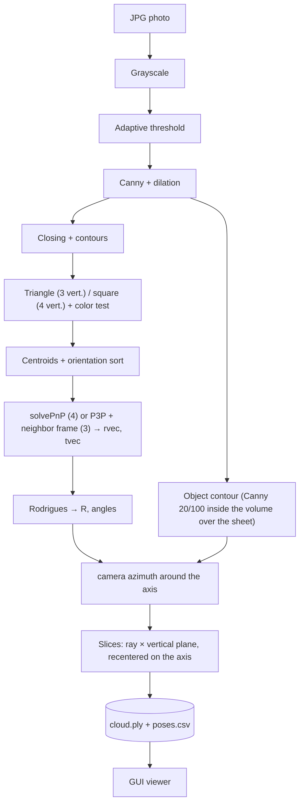

# 3D Reconstruction with OpenCV and Java

Prototype to **reconstruct 3D objects from photos taken around them**, using only a regular camera and an A4 sheet printed with a reference marker. The first version was written in Java with OpenCV 2.4, but it has since been updated to OpenCV 4.9.

> This is the English version of the README. The Portuguese version (`README.md`) is the primary/canonical one; this file is a translation kept in sync with it.

<p align="center">
  
  
</p>
<p align="center"><em>Actual output of the unified project in two frames ~180° apart: T0/S0/T1/S1 are the identified markers, the green rectangle is the model reprojected with the estimated pose, and the axes are X (red), Y (green) and Z (blue, pointing up from the sheet).</em></p>

> **Status:** research prototype. It has a **graphical interface** ("Process images" and "View" buttons plus a point-cloud viewer) and makes use of **116 of 129** example frames, 44 of them with only 3 markers (flagged as lower confidence). The point cloud is assembled by **slices** (each contour becomes a vertical plane rotated by the camera angle) and, in the example photos, has the pot's recognizable shape, with a stable radius (dispersion of ~1 to 2 mm). It is exact for solids of revolution and **approximate** for everything else. See [What works and what doesn't](#what-works-and-what-doesnt).

## Contents

1. [The idea](#the-idea)
2. [The marker](#the-marker)
3. [Process flowchart](#process-flowchart)
4. [Fundamentals: camera, calibration and pose](#fundamentals-camera-calibration-and-pose)
5. [From silhouette to 3D cloud (slices)](#from-silhouette-to-3d-cloud-slices)
6. [Frames with 3 markers](#frames-with-3-markers)
7. [Graphical interface](#graphical-interface)
8. [What works and what doesn't](#what-works-and-what-doesnt)
9. [Repository structure](#repository-structure)
10. [How to run](#how-to-run)
11. [Next steps](#next-steps)

## The idea

An object is placed at the center of an A4 sheet. The camera makes a **360°** turn around it, capturing a frame every few degrees. In each frame:

1. the **marker** printed on the sheet reveals where the camera is and where it's pointing (the *pose*);
2. the **object's contour** is isolated;
3. every pixel of the contour, given the pose, is converted into real-world coordinates (mm);
4. the points from all frames together would form a **3D point cloud**.

In the taxonomy of 3D acquisition techniques, this is a **passive optical** technique (a camera, no light projection) and, in practice, a variation of *Shape from Silhouette* ([Temporal Shape-From-Silhouette](https://www.cs.cmu.edu/~german/research/TSFS/tsfs.html)): the model comes from contours seen from multiple angles.

<p align="center"></p>

## The marker

The marker is **2 black triangles and 2 black squares (≈ 2 × 2 cm)** in the corners of a landscape A4 sheet, with the object at the center. The template used is at [`docs/img/A4-base-scan3D.png`](docs/img/A4-base-scan3D.png) (3508×2480 px = A4 at 300 dpi); the 0°-to-360° polar diagram in the middle is a reference for each photo's angle.

<p align="center">
  
  
</p>

The four centers are the 3D↔2D correspondence points for `solvePnP`. The code assumes the sheet's plane as `Z = 0`, with triangles in the left column and squares in the right:

```text
   tri0 (0, 0)      ────── 187 mm ──────   sq0 (187, 0)
        │                                       │
      161 mm                                  161 mm
        │                                       │
   tri1 (0, 161)    ────── 187 mm ──────   sq1 (187, 161)
```

Measurements on the template (A4 = 297 × 210 mm): using the triangles' centroid, the horizontal spacing comes out to ≈ 185 mm and the vertical to ≈ 160 mm, consistent with the model's 187 × 161 mm. (The minimum enclosing circle's center falls on the middle of the hypotenuse and would give ≈ 178 mm.)

## Process flowchart:



| Step | OpenCV method | Class |
| --- | --- | --- |
| Edges | `cvtColor` → `adaptiveThreshold` (MEAN) → `Canny` → `dilate` | [`MarkerDetector.edges`](src/main/java/scan3d/MarkerDetector.java) |
| Shapes | `morphologyEx(CLOSE)` → `findContours` → `approxPolyDP` → `isContourConvex` + dark/light test | `MarkerDetector.detect` |
| Centers and order | `moments` (centroid) and cross product | `MarkerDetector.order` |
| Pose | `Calib3d.solvePnP`, `projectPoints` (error), `Rodrigues` | [`PoseEstimator`](src/main/java/scan3d/PoseEstimator.java) |
| Object contour | `Canny` 20/100 straight from grayscale, cropped by the reprojected object volume, `findContours` + `drawContours` | [`ObjectContour`](src/main/java/scan3d/ObjectContour.java) |
| Contour → 3D | ray of each pixel intersected with the slice's plane; extremes by height | [`LaminaCloudBuilder`](src/main/java/scan3d/LaminaCloudBuilder.java) |
| Output | ASCII PLY, CSV, images | [`PlyWriter`](src/main/java/scan3d/PlyWriter.java), [`Pipeline`](src/main/java/scan3d/Pipeline.java) |
| Calibration | `findChessboardCorners` → `calibrateCamera` | [`Calibrator`](src/main/java/scan3d/Calibrator.java) |

<p align="center"></p>
<p align="center"><em>Generic illustration of the color → grayscale → edges sequence (reference figure, not actual project output).</em></p>

**Marker detection.** The order `tri0, sq0, tri1, sq1` no longer comes from the enumeration of contours. Over a 360° turn the marker appears at any rotation (halfway through the turn the squares end up on the left), so the code uses orientation instead: since the camera looks at the sheet from above, the cross product between the triangle→square axis and the axis between the two same-type shapes has a fixed sign, which identifies which is "0" and which is "1". Frames with 4 markers give the best-quality pose. With 3, the pose is recovered another way (next section); with fewer, the frame is **skipped**, not guessed.

**The "mask" is a contour, not a filled region.** [`ObjectContour`](src/main/java/scan3d/ObjectContour.java) uses a different edge image than the marker one: `Canny` straight from grayscale (thresholds 20 and 100) with 2×2 dilation, as in the code that generated `out/`. Example02's edges (`adaptiveThreshold` before `Canny`) are good for finding markers, but fragmented the object's contour. Afterward, the object stands inside the markers' rectangle, so the rectangle (shrunk by 25 mm to exclude the markers and extended 250 mm upward) is reprojected with the frame's pose and only edges inside it count. This removes the background, the markers, and the sheet-edge lines that connected to the pot. Among the remaining edges, the component with the largest bounding box is kept, plus a thin band around it. **Limits:** the object needs to fit inside the markers' rectangle and be up to 250 mm tall, and the **back edge of the sheet** still shows up in some frames, behind the object (it falls inside the region along the same line of sight).

<p align="center"></p>
<p align="center"><em>Mask concept (generic image; the actual output is the thin silhouette in <code>output/contours</code>).</em></p>

## Fundamentals: camera, calibration and pose

### Pinhole model

<p align="center">
  
  
</p>

A 3D point `(X, Y, Z)` projects onto pixel `(u, v)` by:

```text
s · [u v 1]ᵀ = K · [R | t] · [X Y Z 1]ᵀ

        [ fx   0  cx ]
    K = [  0  fy  cy ]      intrinsics: depend only on the camera/lens
        [  0   0   1 ]

    [R | t]                 extrinsics: depend on the camera's position in each photo
```

- `fx, fy`: focal length in **pixels**; `(cx, cy)`: principal point (usually the image center).
- If the image is resized, `fx, fy, cx, cy` change by the same proportion.

<p align="center">
  
  
</p>

By similar triangles, with `P` the width in pixels, `W` the real width and `D` the distance, `F = (P · D) / W`. This is useful to estimate a single distance, but **does not replace `solvePnP`**, which uses several points and returns the full pose.

### Intrinsics: `TextMatrix.txt`

The values come from a calibration done in 2017 (8×6 checkerboard, 50 mm squares, `CALIB_FIX_PRINCIPAL_POINT`). The original code only printed the matrix and the numbers were copied by hand into the file's single line. It was ported to the `calibrate` command (see [How to run](#how-to-run)), which now writes the file on its own and, in the 11-value format, also stores the calibration's resolution:

```text
fx, 0, cx, 0, fy, cy, 0, 0, 1
378.8464, 0, 175.5, 0, 378.8464, 143.5, 0, 0, 1                 (original, 9 values)
fx, 0, cx, 0, fy, cy, 0, 0, 1, width, height                    (new, 11 values)
```

<p align="center"></p>
<p align="center"><em><code>A4-circles-pattern.png</code>: alternative calibration pattern (circle grid) kept in <code>docs/img</code>; the code uses a checkerboard.</em></p>

> In the project, over the 72 frames where markers were detected: with the original `TextMatrix.txt`, the median reprojection error is **26 px** (max 47 px); with an approximate camera (`--approx-camera`: `f` = image width, principal point at the center) it drops to **1.2 px**. That's why the program warns when `K` doesn't match the photos' resolution, and the most important step before practical tests is to recalibrate at the camera's real resolution.

### Extrinsics: `solvePnP`

<p align="center"></p>

For each photo, `solvePnP(objectPoints, imagePoints, K, distCoeffs)` (in [`PoseEstimator`](src/main/java/scan3d/PoseEstimator.java)) receives:

- `objectPoints`: the marker's 4 centers in the world, in mm, with `Z = 0` (table above);
- `imagePoints`: the 4 detected centers, in pixels;
- `distCoeffs`: currently **zeros**, i.e. lens distortion is ignored.

It returns `rvec` (rotation, Rodrigues vector) and `tvec` (translation, mm): the **extrinsic of that frame**. `Calib3d.Rodrigues(rvec)` converts `rvec` into a 3×3 matrix `R`.

<p align="center">
  
  
</p>
<p align="center"><em>Right: example of an estimated pose and reprojection. The project does something similar in <code>output/annotated</code>, drawing the model's frame and axes over the sheet.</em></p>

### Angles

`PoseEstimator` extracts Euler angles (Z-Y-X convention) from `R` and writes them to `poses.csv`. Each frame's angle **around the object** is not one of them: it's the camera's azimuth relative to the sheet's center, computed from `R` and `t` in [`LaminaCloudBuilder`](src/main/java/scan3d/LaminaCloudBuilder.java).

<p align="center">
  
  
</p>

## From silhouette to 3D cloud (slices)

The idea: treat each photo's contour as a **standing 2D slice**, on the vertical plane that passes through the rotation axis (Z, through the sheet's center), and rotate the slice by that frame's camera angle. The set of slices forms the object. Implemented in [`LaminaCloudBuilder`](src/main/java/scan3d/LaminaCloudBuilder.java):

1. **Angle.** The camera's azimuth around the sheet's center, taken from the pose, relative to the first frame (which is set to 0°). The actual steps are irregular (hand-held camera), so no fixed 1° or 2° step is assumed.
2. **Position and scale.** Each contour pixel is cast as a ray from the camera and **intersected with the slice's plane**. This handles perspective and camera tilt at once, and normalizes size: the image scale changes with distance (in the example photos, almost 2×) and height (higher points appear closer), but an object of the same size gives the same size in any frame.
3. **Unit.** The cloud comes out in **reference pixels** (a pixel from the first frame at axis height), without mm. It's just a constant unit change, so the scale is linear; the factor (px per mm of sheet) is kept in the PLY header, in case you want to convert later.
4. **Outer silhouette.** For each height, only the leftmost and rightmost points of the contour. Internal edges (label, etc.) are left out, and isolated spikes (e.g. the sheet's edge touching the object) are discarded. Top and bottom are intentionally excluded: with the camera above the object their ellipses appear shifted in height.
5. **Object center.** The slices assume the object sits on the axis, but it's actually a few mm off the sheet's center (~7 mm in the example photos), which distorts the projection. Since the center is fixed, the average of the left and right extremes in each frame equals `e·t`; the offset `e` is estimated by robust least squares over all frames and the object is recentered on the axis. This reduced the per-height radius dispersion from ~11 mm to 1–2 mm.
6. **Closed turn.** Each slice is bilateral (left and right of the axis), and the view from the opposite side falls on the same plane with the silhouette mirrored. Mirroring the slices therefore adds no points: azimuths spanning A degrees close about 2·A degrees around the axis. The program measures and reports this coverage.

In the example photos (azimuths from −86° to +80°, ~166°, not 360°): 37,860 points, coverage of **296° out of 360°** (the rest are gaps between frames) and radius from 29 to 31 mm with dispersion of 0.6 to 1.8 mm per height band, including the lower-confidence frames. The profile has a "waist" (~29 mm at 30–50 mm height) and "shoulders" (~31 mm), like the photographed pot.

**Limits.** Exact for solids of revolution (the silhouette's width is the radius), like the pot. For other shapes it's an approximation: the edge point is placed on the axis's plane, when it could be further forward or back, so flat faces get "puffed up" and concave parts disappear. The general method is the *visual hull* (intersection of extruded silhouettes). The object needs to be approximately over the sheet's center (the fixed offset is corrected, but not an object that moves).

<p align="center"></p>
<p align="center"></p>
<p align="center"><em>Actual output (example photos): perspective and top view. The two gaps in the ring are the angles with no frames.</em></p>

The examples below show the **kind of result being aimed for** (a real object, its point cloud and mesh); these were generated by other methods:

<p align="center"></p>
<p align="center"></p>

## Frames with 3 markers

The 4 markers don't always show up: one may end up behind the object, out of frame, or blurred. Instead of discarding these frames, the program tries to **recover the pose with 3** and flags it as **lower confidence**. Frames without 3 usable markers are skipped, with the reason logged and written to `skipped.txt`.

With 3 points there are two ambiguities: which marker of the type that appears only once it is (the "0" or the "1"), and P3P returns up to 4 solutions. The program tests every hypothesis and keeps the pose closest to a **neighboring frame with 4 markers**, discarding physically impossible poses (camera below the sheet). Implementation details in [`PoseEstimator.estimateFromThree`](src/main/java/scan3d/PoseEstimator.java) and [`Pipeline`](src/main/java/scan3d/Pipeline.java):

- The reference must be within `--max-gap` frames (default 3). The pose is only accepted if it's within 60 mm per frame of distance and 30° from the reference.
- Already-resolved 3-marker frames serve as references for the following ones, in layers, up to 8 hops. Each pose comes from an independent P3P (the reference only breaks ties), so error doesn't accumulate.
- There's no reprojection error with 3 points (the fit is exact), so that column stays empty; what exists is the distance to the reference.
- The pose (not the detection) is what defines where the object can be in the image: the object's contour is only valid inside the volume over the markers' rectangle reprojected with it, which also works when a marker is hidden.

A simpler heuristic (deciding the marker's identity from geometry alone) only got 71% right, hence the hypothesis testing.

Result over the 129 example photos: **72 frames with 4 markers + 44 with 3 = 116 used (90%)**, versus 72 (56%) without this step. Among the 44, the difference to the reference is 20 mm (median), 56 mm (p90) and 132 mm (max). To use only complete frames, pass `--min-markers 4`.

In the outputs, confidence appears as the `markers`/`confidence` column in `poses.csv`, the `markers` property in `cloud.ply`, and is highlighted in **orange** with a warning in the photo and in the GUI.

## Graphical interface

```bash
./scan3d.sh gui
```

<p align="center"></p>

- **Process images**: runs the pipeline in the background, showing the current phase, a progress bar and the log of skipped frames. If the output folder already has a result, it asks for confirmation before overwriting. When it finishes, it loads the result.
- **View**: enabled when the output folder already has a `cloud.ply` (e.g. from a previous run); opens the cloud, frames and contours without reprocessing.
- **Open output folder**: opens the folder in Finder.
- Options: photo folder, output folder, approximate camera or camera file, and whether to accept frames with 3 markers.

The **Point cloud** tab is a custom JavaFX viewer (no OpenGL): it projects the points with perspective onto a pixel buffer with a z-buffer. Dragging rotates, Shift/right-click pans, the wheel zooms, and double-click resets. You can color by height, by frame (turn order) or by pose confidence, hide 3-marker points, hide the 1% most extreme points, and change the point size.

<p align="center"></p>

The **Frames** tab lists every photo (green = 4 markers, orange = 3, red = skipped) and shows the annotated photo and the reason. For frames with a pose, the annotation shows the markers, the frame and the axes (discarded shapes appear in gray); for skipped ones, it shows every detected shape (triangles `T` in magenta, squares `S` in yellow), to see what the detector saw.

<p align="center"></p>

The **Contours** tab lists the frames that have a contour (the number next to it is the pixel count) and shows the object's contour **over the photo** (in red, with the photo darkened) or **just the contour**, in black and white, as written to `output/contours`. It's useful to check whether the contour is over the object and see what got included along with it, like the sheet's back edge and label details. You can filter by pose confidence (4 or 3 markers).

<p align="center"></p>

Notes:

- The displayed cloud is the slice-based one (see above). The shown axes and units are in reference pixels; the PLY header, shown at the bottom of the window, carries the scale.
- Since JavaFX ships native libraries per system, the jar generated by `mvn package` only works on the system it was built on.
- Window test modes, used to generate the screenshots above: `--load` (opens already with results), `--process` (triggers the same path as the button) and `--screenshot FILE --tab N` (saves the screenshot and closes; tabs: 0 Processing, 1 Cloud, 2 Frames, 3 Contours).

## What works and what doesn't

Result of `./scan3d.sh scan --approx-camera` over the 129 photos in `in/`:

| Step | Status |
| --- | --- |
| Marker detection and ordering | ✅ 72 frames with 4 markers; consistent ordering on both sides of the turn (24 synthetic rotations + visual check) |
| Frames with 3 markers | ✅ 44 recovered, flagged as lower confidence (validation and limits in [Frames with 3 markers](#frames-with-3-markers)) |
| Skipped frames | 14 of 129, with a reason (115 used; 6 frames with 2 triangles + 3 squares were recovered by discarding the extra shape). 2 remain with 1 triangle and 3 squares, 3 with 1 and 1, and 9 with 3 markers and no reliable reference |
| Pose | ✅ median reprojection error 1.2 px (approximate camera); ⚠️ 26 px with the original `TextMatrix.txt` |
| Object contour | ✅ present in all 116 frames, continuous in most (median of ~1.4k pixels); ⚠️ includes the sheet's back edge and label details in some frames |
| Point cloud | ✅ 37,860 points with the pot's shape, stable radius (dispersion of 0.6 to 1.8 mm), coverage of 296° out of 360°; ⚠️ approximation for non-revolution objects |
| 360° turn | ✅ the pose's `rz` angle covers −179° to +180° |
| Graphical interface and viewer | ✅ process, view, navigate frames (tested via screenshots; the user's button clicks were not exercised by me) |

Limitations and points of attention:

- Use `--approx-camera` on the example photos and recalibrate for practical tests.
- **Lens distortion is ignored** (`distCoeffs` = 0). `calibrate` prints the coefficients, but the pipeline doesn't use them yet.
- **The slice-based cloud is exact only for solids of revolution.** For other shapes, the edge point is placed on the axis's plane, so flat faces get "puffed up" and concave parts disappear. The general method is the *visual hull*.
- **Cloud quality depends on `K`.** With `TextMatrix.txt` the pose comes out imprecise; the example photos were processed with the approximate camera. Recalibrate before practical tests.
- Failures are expected: the program skips frames it can't process and continues with the rest.

## Repository structure

| Path | Contents |
| --- | --- |
| [`pom.xml`](pom.xml) | Maven project: Java 21, `org.openpnp:opencv` 4.9 (brings the native libraries), JUnit 5 |
| [`src/main/java/scan3d`](src/main/java/scan3d) | Code: detector, pose, contour, cloud, PLY (writing and reading), calibration, CLI |
| [`src/main/java/scan3d/gui`](src/main/java/scan3d/gui) | JavaFX graphical interface: window, cloud viewer, frame browser |
| [`src/test/java/scan3d`](src/test/java/scan3d) | Automated tests |
| [`scan3d.sh`](scan3d.sh) | Builds if needed and runs (picks the Homebrew JDK 21) |
| [`in/800x480 com objeto`](in/800x480%20com%20objeto) | 129 test photos (JPG 800×480) of a pot on the sheet |
| [`out/`](out) | 10 historical outputs (`*.matMask.jpg`), the best frames from the start of the sequence. **Not** the current program's output |
| `output/` | Current program's output (git-ignored): `annotated/`, `contours/`, `poses.csv`, `cloud.ply`, `skipped.txt` |
| [`docs/img`](docs/img) | Figures used in this README |
| [`TextMatrix.txt`](TextMatrix.txt) | Original intrinsic matrix (9 values, calibrated at another resolution) |
| [`lib/`](lib) | Legacy: `opencv-2413.jar` and Linux `.so` files from OpenCV 2.4. **No longer used** |
| [`install-linux.md`](install-linux.md) | Historical step-by-step (Ubuntu 16.04, Eclipse Luna, OpenCV 2.4) |

## How to run

### Installation on macOS

```bash
brew install openjdk@21 maven
```

OpenCV **doesn't need to be installed**: the `org.openpnp:opencv` Maven package brings the native library (including for macOS ARM64) and the program extracts it on its own. Homebrew's JDK 21 is *keg-only*, so `scan3d.sh` already locates it; to use it from the terminal:

```bash
echo 'export JAVA_HOME=/opt/homebrew/opt/openjdk@21' >> ~/.zshrc
```

Nothing was automatically changed in `~/.zshrc`.

### Run

```bash
./scan3d.sh gui                           # window: Process images / View
./scan3d.sh scan --approx-camera          # command line: example photos, approximate K; output in output/
./scan3d.sh scan --in MY_FOLDER --camera MY_CAMERA.txt --out output/test1
./scan3d.sh scan --approx-camera --min-markers 4   # only frames with all 4 markers
./scan3d.sh calibrate --in CHECKERBOARD_PHOTOS --pattern 8x6 --square 50   # writes TextMatrix.txt
./scan3d.sh --help
```

The first `scan3d.sh` run builds the project (downloads dependencies and generates a ~120 MB jar, since it embeds OpenCV's native libraries for every system and JavaFX's for the current one). `scan` options: `--in`, `--out`, `--camera`, `--approx-camera`, `--limit N`, `--min-markers 3|4` (default 3) and `--max-gap N` (default 3). Output:

| File | Contents |
| --- | --- |
| `output/annotated/*.jpg` | photo with markers, IDs, model frame and pose axes |
| `output/contours/*.png` | object contour |
| `output/poses.csv` | per frame: `markers` (4 or 3) and `confidence` (`high`/`low`), `tx, ty, tz` (mm), `rx, ry, rz` (degrees), reprojection error (px; empty with 3 markers), `ref_frame`, `ref_hops`, `ref_dist_mm` (only with 3) and number of points |
| `output/cloud.ply` | accumulated cloud, with the `frame` and `markers` properties |
| `output/skipped.txt` | one skipped frame per line, with the reason |

### For practical tests

1. Photograph a printed **checkerboard** (e.g. 8×6 inner corners, 50 mm squares) in 15 or more positions, **at the same resolution** you'll use for the object, and run `calibrate`.
2. Print the template ([`docs/img/A4-base-scan3D.png`](docs/img/A4-base-scan3D.png)) on A4 **without scaling/page fitting** and check with a ruler that the markers' centers are 187 × 161 mm apart; if it differs, change `WIDTH_MM`/`HEIGHT_MM` in [`PoseEstimator`](src/main/java/scan3d/PoseEstimator.java).
3. Whenever possible, keep **all four markers visible** in each photo and the object at the center, without covering any of them. Frames with 3 still work (lower confidence), but with fewer than that the frame is skipped. For the chaining to work, photograph in sequence with the camera moving little between photos (here, ~6 mm per frame).
4. Use diffuse light: shadows and reflections break up contours.

## Next steps

In order of effort-to-return:

1. **Recalibrate** at the real resolution and pass `distCoeffs` to `solvePnP` and to the inversion.
2. **Visual hull** (intersection of extruded silhouettes) for non-revolution objects; the slice method puffs up flat faces and loses concavities. Needs a filled silhouette (item 3).
3. **Segment the object against the white paper** (threshold/GrabCut inside the reprojected region) to get a **filled** silhouette, needed for the *visual hull* and to avoid the sheet-edge lines that still leak into the current contour.
4. **Extra shapes with 1 triangle or 1 square** (2 frames today): the distance ratio doesn't exist; another criterion would be needed, such as the reprojection error of each combination.
5. Filter/weight points from lower-confidence frames in the reconstruction and measure the effect with real photos.
6. Port to Android (OpenCV Android + the same logic), after validating the math.
