# Reconstrução 3D com OpenCV e Java

Protótipo para **reconstruir objetos em 3D a partir de fotos tiradas ao redor deles**, usando apenas uma câmera comum e uma folha A4 impressa com um marcador de referência. A primeira versão foi feita em Java no Eclipse (Linux) com OpenCV 2.4, pensando em rodar depois em Android. Hoje o repositório é **um único projeto Maven** (Java 21, OpenCV 4.9) que roda no macOS, incluindo Apple Silicon.

<p align="center">
  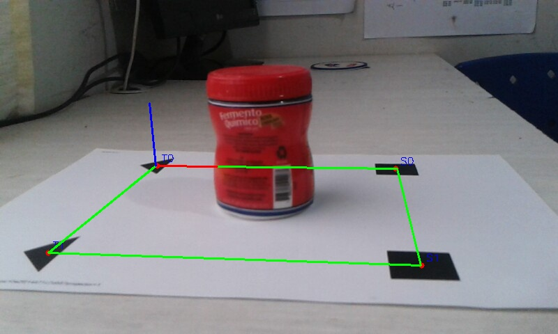
  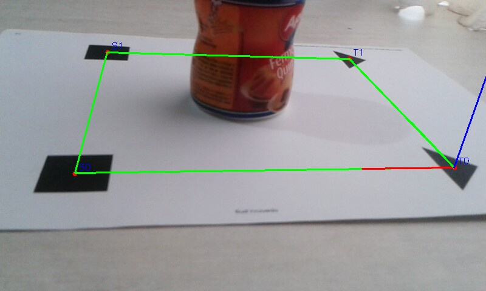
</p>
<p align="center"><em>Saída real do projeto unificado em dois quadros com ~180° de diferença: T0/S0/T1/S1 são os marcadores identificados, o retângulo verde é o modelo reprojetado com a pose estimada, e os eixos são X (vermelho), Y (verde) e Z (azul, para cima da folha).</em></p>

> **Status:** protótipo de pesquisa. O pipeline roda de ponta a ponta, tem **interface gráfica** (botões "Processar imagens" e "Visualizar" e visualizador de nuvem) e aproveita **116 de 129** quadros de exemplo, 44 deles com só 3 marcadores (marcados como confiança menor). A nuvem de pontos é montada por **lâminas** (cada contorno vira um plano vertical girado pelo ângulo da câmera) e, nas fotos de exemplo, tem a forma reconhecível do pote, com raio estável (dispersão de ~1 a 2 mm). É exata para objetos de revolução e **aproximada** para os demais. Veja [O que funciona e o que não funciona](#o-que-funciona-e-o-que-não-funciona).

## Sumário

1. [A ideia](#a-ideia)
2. [O marcador](#o-marcador)
3. [Pipeline](#pipeline)
4. [Fundamentos: câmera, calibração e pose](#fundamentos-câmera-calibração-e-pose)
5. [Da silhueta à nuvem 3D (lâminas)](#da-silhueta-à-nuvem-3d-lâminas)
6. [Quadros com 3 marcadores](#quadros-com-3-marcadores)
7. [Interface gráfica](#interface-gráfica)
8. [O que funciona e o que não funciona](#o-que-funciona-e-o-que-não-funciona)
9. [Do legado ao projeto unificado](#do-legado-ao-projeto-unificado)
10. [Sobre o `out/`](#sobre-o-out)
11. [Estrutura do repositório](#estrutura-do-repositório)
12. [Como executar](#como-executar)
13. [Próximos passos](#próximos-passos)
14. [Skills para o Claude Code](#skills-para-o-claude-code)

## A ideia

Um objeto é colocado no centro de uma folha A4. A câmera dá uma volta de **360°** ao redor dele, capturando um quadro a cada poucos graus. Em cada quadro:

1. o **marcador** impresso na folha revela onde a câmera está e para onde aponta (a *pose*);
2. o **contorno do objeto** é isolado;
3. cada pixel do contorno, sabendo a pose, é convertido em coordenadas reais (mm);
4. os pontos de todos os quadros, juntos, formariam uma **nuvem de pontos 3D**.

Na taxonomia de técnicas de aquisição 3D, isto é uma técnica **óptica passiva** (uma câmera, sem projetar luz) e, na prática, uma variação de *Shape from Silhouette*: o modelo vem dos contornos vistos de vários ângulos.

<p align="center">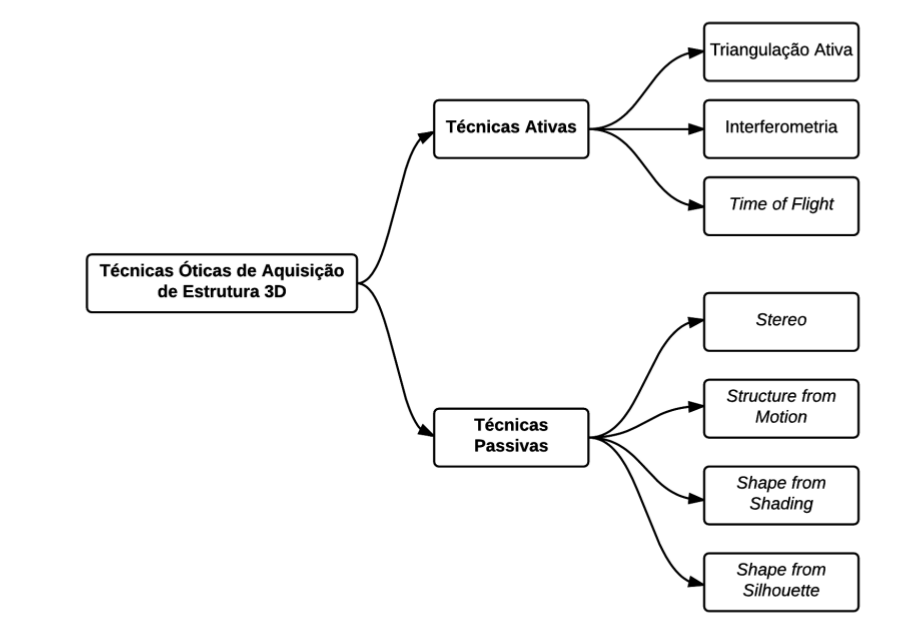</p>

## O marcador

O marcador são **2 triângulos e 2 quadrados pretos (≈ 2 × 2 cm)** nos cantos de uma folha A4 em paisagem, com o objeto no centro. O gabarito usado está em [`docs/img/imagem-base-referencia-coordenada.png`](docs/img/imagem-base-referencia-coordenada.png) (3508×2480 px = A4 a 300 dpi); o diagrama polar de 0° a 360° no meio serve de referência para o ângulo de cada foto.

<p align="center">
  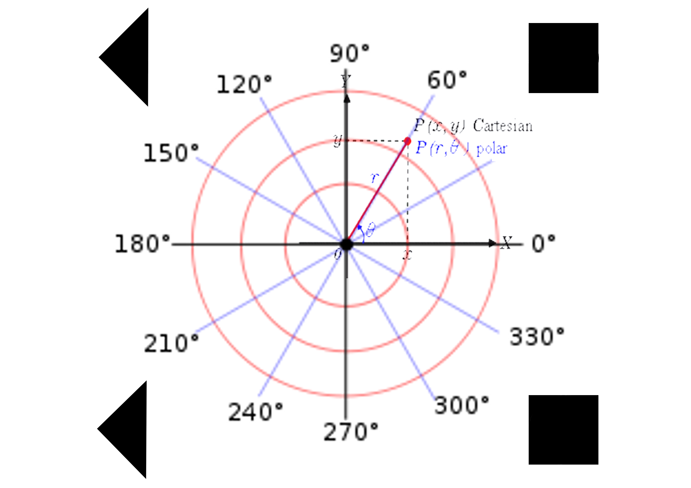
  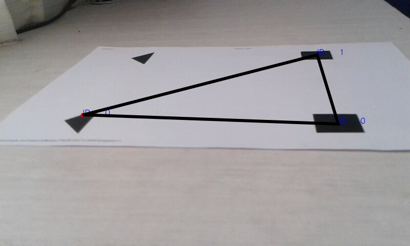
</p>

Os quatro centros são os pontos de correspondência 3D↔2D do `solvePnP`. O código assume o plano da folha como `Z = 0`, com os triângulos na coluna esquerda e os quadrados na direita:

```text
   tri0 (0, 0)      ────── 187 mm ──────   sq0 (187, 0)
        │                                       │
      161 mm                                  161 mm
        │                                       │
   tri1 (0, 161)    ────── 187 mm ──────   sq1 (187, 161)
```

Conferi as medidas sobre o gabarito (A4 = 297 × 210 mm): usando o centroide dos triângulos, o espaçamento horizontal dá ≈ 185 mm e o vertical ≈ 160 mm, coerente com os 187 × 161 mm do modelo. (O centro do círculo mínimo, usado no código antigo, cai no meio da hipotenusa e daria ≈ 178 mm.)

## Pipeline

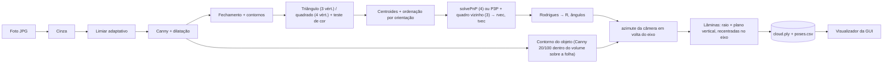
```mermaid
flowchart LR
    A[Foto JPG] --> B[Cinza]
    B --> C[Limiar adaptativo]
    C --> D[Canny + dilatação]
    D --> E["Fechamento + contornos"]
    E --> F["Triângulo (3 vért.) / quadrado (4 vért.) + teste de cor"]
    F --> G["Centroides + ordenação por orientação"]
    G --> H["solvePnP (4) ou P3P + quadro vizinho (3) → rvec, tvec"]
    H --> I["Rodrigues → R, ângulos"]
    D --> J["Contorno do objeto (Canny 20/100 dentro do volume sobre a folha)"]
    I --> K["azimute da câmera em volta do eixo"]
    J --> K
    K --> L["Lâminas: raio × plano vertical, recentradas no eixo"]
    L --> M[(cloud.ply + poses.csv)]
    M --> N[Visualizador da GUI]
```

| Etapa | Método OpenCV | Classe |
| --- | --- | --- |
| Bordas | `cvtColor` → `adaptiveThreshold` (MEAN) → `Canny` → `dilate` | [`MarkerDetector.edges`](src/main/java/scan3d/MarkerDetector.java) |
| Formas | `morphologyEx(CLOSE)` → `findContours` → `approxPolyDP` → `isContourConvex` + teste escuro/claro | `MarkerDetector.detect` |
| Centros e ordem | `moments` (centroide) e produto vetorial | `MarkerDetector.order` |
| Pose | `Calib3d.solvePnP`, `projectPoints` (erro), `Rodrigues` | [`PoseEstimator`](src/main/java/scan3d/PoseEstimator.java) |
| Contorno do objeto | `Canny` 20/100 direto do cinza, recorte pelo volume do objeto reprojetado, `findContours` + `drawContours` | [`ObjectContour`](src/main/java/scan3d/ObjectContour.java) |
| Contorno → 3D | raio de cada pixel intersectado com o plano da lâmina; extremos por altura | [`LaminaCloudBuilder`](src/main/java/scan3d/LaminaCloudBuilder.java) |
| Saída | PLY ASCII, CSV, imagens | [`PlyWriter`](src/main/java/scan3d/PlyWriter.java), [`Pipeline`](src/main/java/scan3d/Pipeline.java) |
| Calibração | `findChessboardCorners` → `calibrateCamera` | [`Calibrator`](src/main/java/scan3d/Calibrator.java) |

<p align="center">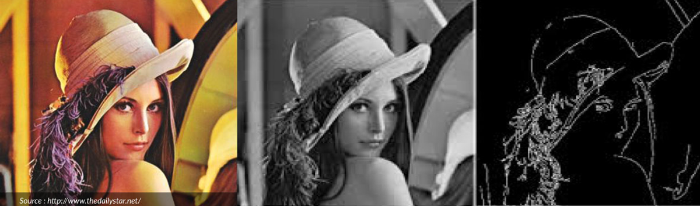</p>
<p align="center"><em>Ilustração genérica da sequência cor → cinza → bordas (figura de referência, não é saída do projeto).</em></p>

**Detecção do marcador.** A ordem `tri0, sq0, tri1, sq1` não vem mais da enumeração dos contornos. Em uma volta de 360° o marcador aparece em qualquer rotação (na metade da volta os quadrados ficam à esquerda), então o código usa a orientação: como a câmera vê a folha de cima, o produto vetorial entre o eixo triângulo→quadrado e o eixo entre as duas formas iguais tem sinal fixo, o que identifica qual é a "0" e qual é a "1". Quadros com 4 marcadores dão a pose de melhor qualidade. Com 3, a pose é recuperada por outro caminho (próxima seção); com menos, o quadro é **ignorado**, não adivinhado.

**A "máscara" é um contorno, não uma região preenchida.** [`ObjectContour`](src/main/java/scan3d/ObjectContour.java) usa outra imagem de bordas que a dos marcadores: `Canny` direto do cinza (limiares 20 e 100) com dilatação 2×2, como no código que gerou o `out/` (veja [Sobre o `out/`](#sobre-o-out)). As bordas do Example02 (`adaptiveThreshold` antes do `Canny`) servem para achar os marcadores, mas fragmentavam o contorno do objeto. Depois, o objeto fica em pé dentro do retângulo dos marcadores, então o retângulo (encolhido 25 mm para excluir os marcadores e esticado 250 mm para cima) é reprojetado com a pose do quadro e só as bordas dentro dele valem. Isso tira o fundo, os marcadores e as linhas da borda da folha que se ligavam ao pote. Entre as bordas restantes, fica o componente de maior caixa envolvente e uma banda fina em volta dele. **Limites:** o objeto precisa caber no retângulo dos marcadores e ter até 250 mm de altura, e a **borda de trás da folha** ainda aparece em alguns quadros, atrás do objeto (cai dentro da região pela mesma linha de visada).

<p align="center">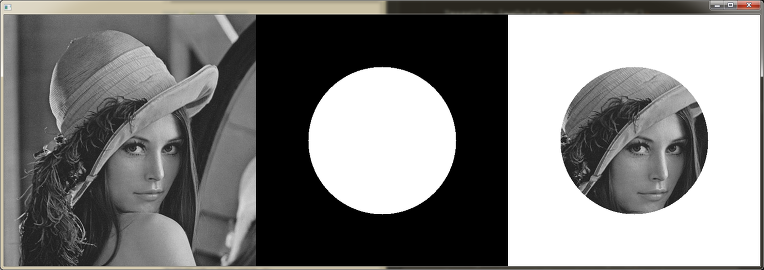</p>
<p align="center"><em>Conceito de máscara (imagem genérica; a saída real é a silhueta fina em <code>output/contours</code>).</em></p>

## Fundamentos: câmera, calibração e pose

### Modelo pinhole

<p align="center">
  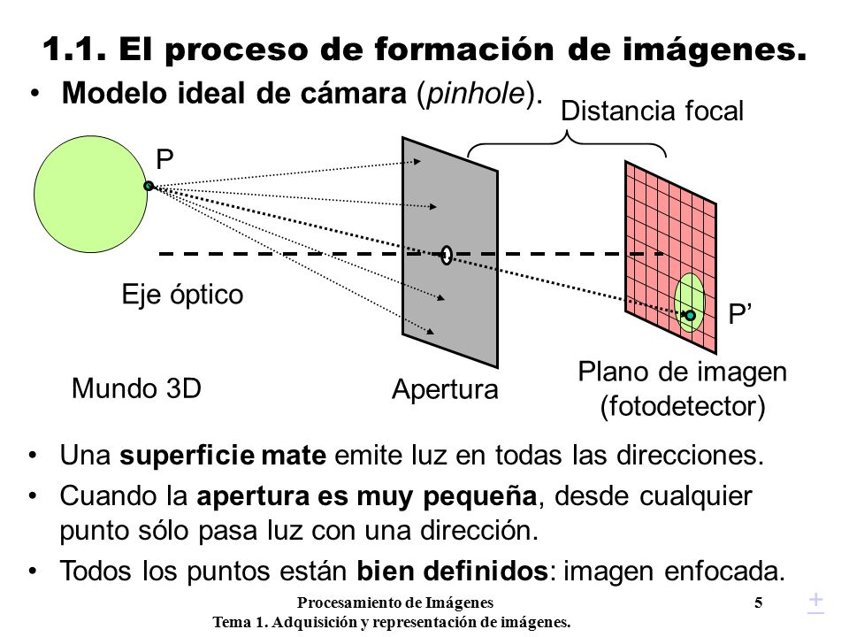
  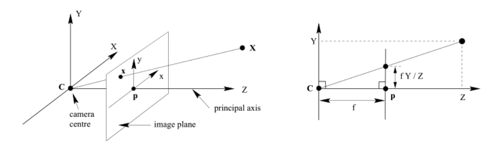
</p>

Um ponto 3D `(X, Y, Z)` projeta-se no pixel `(u, v)` por:

```text
s · [u v 1]ᵀ = K · [R | t] · [X Y Z 1]ᵀ

        [ fx   0  cx ]
    K = [  0  fy  cy ]      intrínsecos: dependem só da câmera/lente
        [  0   0   1 ]

    [R | t]                 extrínsecos: dependem da posição da câmera em cada foto
```

- `fx, fy`: distância focal em **pixels**; `(cx, cy)`: ponto principal (em geral o centro da imagem).
- Se a imagem for redimensionada, `fx, fy, cx, cy` mudam na mesma proporção.

<p align="center">
  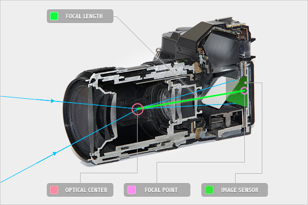
  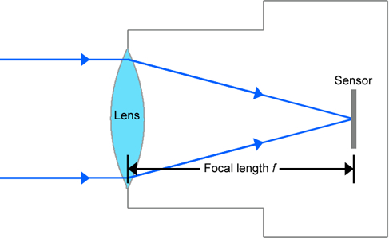
</p>

Pela semelhança de triângulos, com `P` a largura em pixels, `W` a largura real e `D` a distância, vale `F = (P · D) / W`. Serve para estimar uma distância isolada, mas **não substitui o `solvePnP`**, que usa vários pontos e devolve a pose completa.

### Intrínsecos: `TextMatrix.txt`

Os valores vêm de uma calibração feita em 2017 (tabuleiro 8×6, quadrados de 50 mm, `CALIB_FIX_PRINCIPAL_POINT`). O código original só imprimia a matriz e os números foram copiados à mão para a única linha do arquivo. Ele foi portado para o comando `calibrate` (veja [Como executar](#como-executar)), que agora grava o arquivo sozinho e, no formato de 11 valores, guarda também a resolução da calibração:

```text
fx, 0, cx, 0, fy, cy, 0, 0, 1
378.8464, 0, 175.5, 0, 378.8464, 143.5, 0, 0, 1                 (original, 9 valores)
fx, 0, cx, 0, fy, cy, 0, 0, 1, largura, altura                   (novo, 11 valores)
```

<p align="center">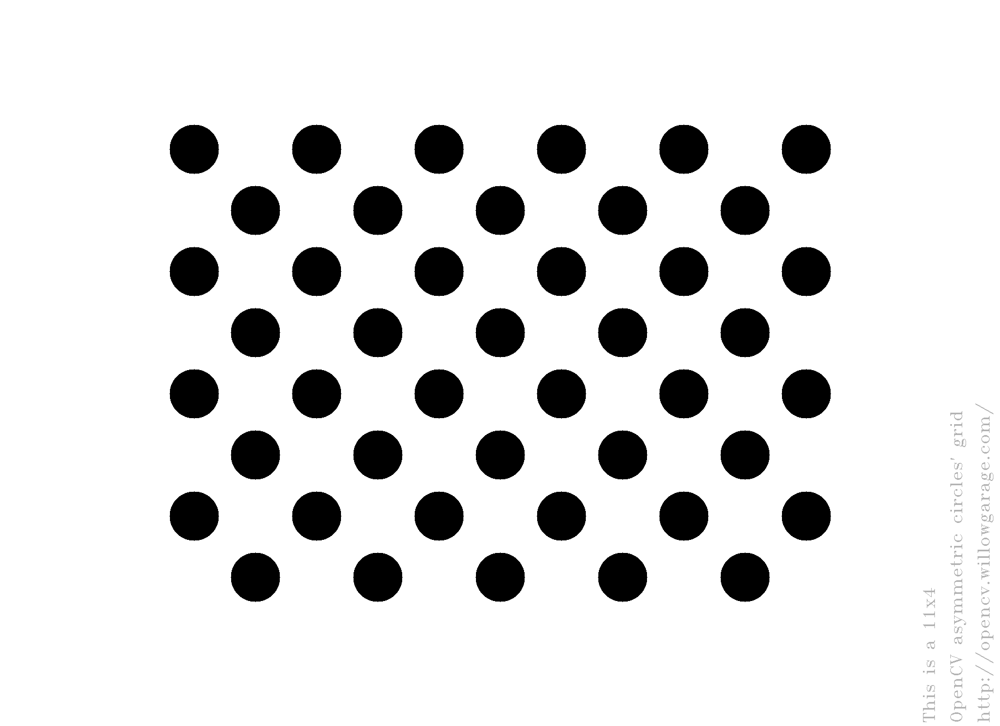</p>
<p align="center"><em><code>A4-circles-pattern.png</code>: padrão alternativo de calibração (grade de círculos) que consta em <code>docs/img</code>; o código usa tabuleiro de xadrez.</em></p>

> ⚠️ **Resolução inconsistente.** `cx = 175.5` e `cy = 143.5` correspondem ao centro de uma imagem de ~351 × 287 px, e a calibração fixou o ponto principal nesse centro. As fotos de `in/` têm **800 × 480** (proporção diferente, 1,67 contra 1,22). Medido no projeto unificado sobre os 72 quadros em que os marcadores foram detectados: com o `TextMatrix.txt` original o erro de reprojeção mediano é **26 px** (máximo 47 px); com uma câmera aproximada (`--approx-camera`: `f` = largura da imagem, ponto principal no centro) cai para **1,2 px**. Por isso o programa avisa quando `K` não combina com a resolução das fotos, e o passo mais importante antes dos testes práticos é recalibrar na resolução real da câmera.

No código antigo, `readMatCamTxt` e os métodos `paramExtrinseco`/`paramIntrinseco` tinham os nomes trocados (o arquivo contém os **intrínsecos**). No projeto unificado os nomes foram corrigidos.

### Extrínsecos: `solvePnP`

<p align="center">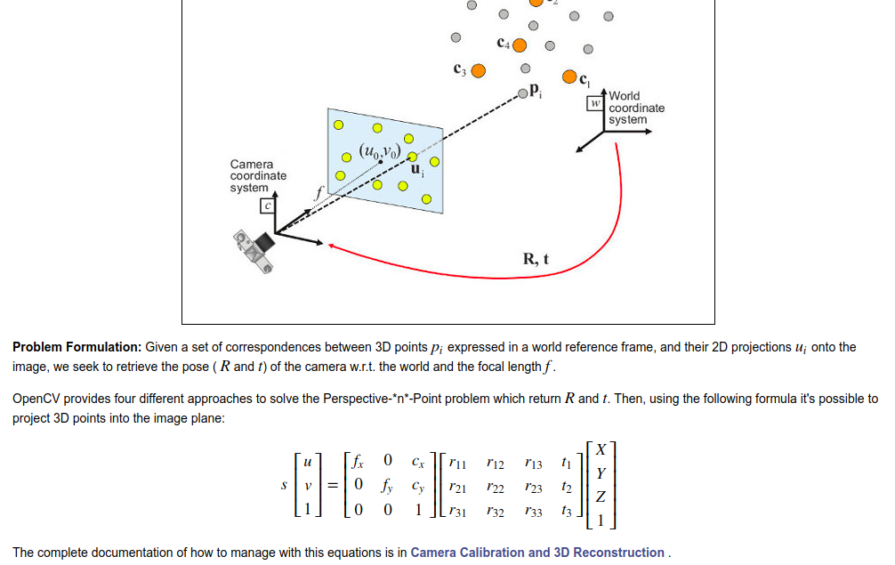</p>

Para cada foto, `solvePnP(objectPoints, imagePoints, K, distCoeffs)` (em [`PoseEstimator`](src/main/java/scan3d/PoseEstimator.java)) recebe:

- `objectPoints`: os 4 centros do marcador no mundo, em mm, com `Z = 0` (tabela acima);
- `imagePoints`: os 4 centros detectados, em pixels;
- `distCoeffs`: hoje **zeros**, ou seja, ignora a distorção da lente.

Devolve `rvec` (rotação, vetor de Rodrigues) e `tvec` (translação, mm): o **extrínseco daquele quadro**. `Calib3d.Rodrigues(rvec)` converte `rvec` em matriz `R` 3×3.

<p align="center">
  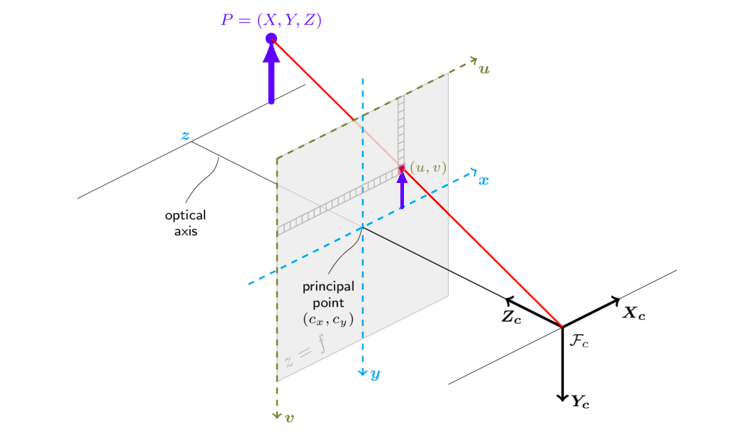
  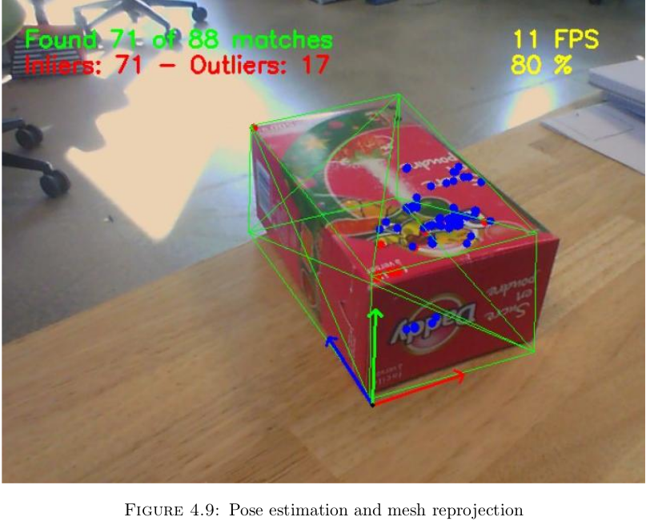
</p>
<p align="center"><em>Direita: exemplo de terceiros de pose estimada e reprojeção (arquivo <code>detectacao-objeto-retangular.png</code>). O projeto unificado faz algo parecido em <code>output/annotated</code>, desenhando a moldura do modelo e os eixos sobre a folha.</em></p>

### Ângulos

`PoseEstimator` extrai ângulos de Euler (convenção Z-Y-X) de `R` e os grava em `poses.csv`. O ângulo de cada quadro **em volta do objeto** não é um deles: é o azimute da câmera em relação ao centro da folha, calculado a partir de `R` e `t` em [`LaminaCloudBuilder`](src/main/java/scan3d/LaminaCloudBuilder.java).

<p align="center">
  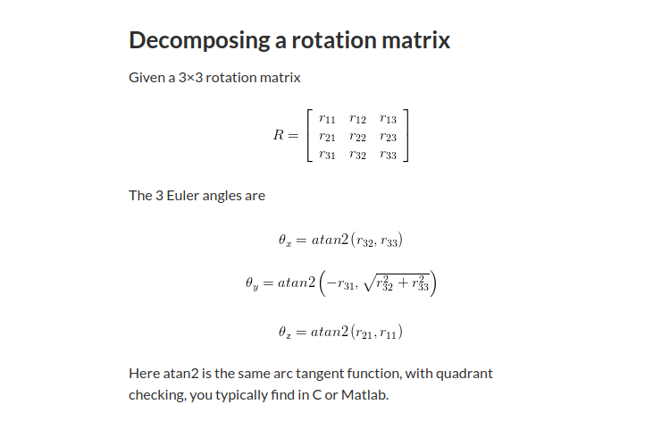
  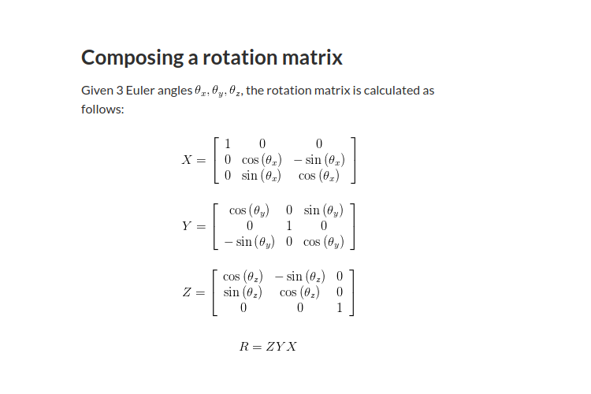
</p>

## Da silhueta à nuvem 3D (lâminas)

A ideia: tratar o contorno de cada foto como uma **lâmina 2D em pé**, no plano vertical que passa pelo eixo de giro (Z, pelo centro da folha), e girar a lâmina pelo ângulo da câmera naquele quadro. O conjunto das lâminas forma o objeto. Implementação em [`LaminaCloudBuilder`](src/main/java/scan3d/LaminaCloudBuilder.java):

1. **Ângulo.** O azimute da câmera em volta do centro da folha, tirado da pose, relativo ao primeiro quadro (que fica em 0°). Os passos reais são irregulares (câmera na mão), então não se supõe 1 ou 2° fixos.
2. **Posição e escala.** Cada pixel do contorno é lançado como um raio a partir da câmera e **intersectado com o plano da lâmina**. Isso trata a perspectiva e a inclinação da câmera de uma vez, e normaliza o tamanho: a escala da imagem muda com a distância (nas fotos de exemplo, quase 2×) e com a altura (pontos mais altos ficam mais perto), mas um objeto do mesmo tamanho dá o mesmo tamanho em qualquer quadro. Uma versão que usava uma escala única por quadro superestimava o raio em cerca de 6% no topo (um teste sintético pegou isso).
3. **Unidade.** A nuvem sai em **pixels de referência** (um pixel do primeiro quadro na altura do eixo), sem mm. É só uma mudança de unidade constante, então a escala é linear; o fator (px por mm da folha) fica no cabeçalho do PLY, caso queira converter depois.
4. **Silhueta externa.** Para cada altura, só os extremos esquerdo e direito do contorno. Bordas internas (rótulo etc.) ficam de fora, e picos isolados (por exemplo, a borda da folha encostada no objeto) são descartados. O topo e a base não entram de propósito: com a câmera acima do objeto as elipses deles aparecem deslocadas em altura.
5. **Centro do objeto.** As lâminas supõem o objeto sobre o eixo, mas ele fica alguns mm fora do centro da folha (~7 mm nas fotos de exemplo), o que deforma a forma. Como o centro é fixo, a média dos extremos esquerdo e direito em cada quadro vale `e·t`; o deslocamento `e` é estimado por mínimos quadrados robustos sobre todos os quadros e o objeto é recentrado no eixo. Isso reduziu a dispersão do raio por altura de ~11 mm para 1 a 2 mm.
6. **Volta fechada.** Cada lâmina é bilateral (esquerda e direita do eixo) e a vista do lado oposto cai no mesmo plano com a silhueta espelhada. Espelhar as lâminas, portanto, não acrescenta pontos: azimutes cobrindo A graus fecham cerca de 2·A graus em volta do eixo. O programa mede e informa essa cobertura.

Nas fotos de exemplo (azimutes de −86° a +80°, ~166°, e não 360°): 37.860 pontos, cobertura de **296° de 360°** (o resto são lacunas entre quadros) e raio de 29 a 31 mm com dispersão de 0,6 a 1,8 mm em cada faixa de altura, incluindo os quadros de confiança menor. O perfil tem "cintura" (~29 mm a 30 a 50 mm de altura) e "ombros" (~31 mm), como o pote das fotos.

**Limites.** É exata para corpos de revolução (a largura da silhueta é o raio), como o pote. Para outros formatos é uma aproximação: o ponto da borda é posto no plano do eixo, quando poderia estar mais à frente ou atrás, então faces planas ficam "estufadas" e partes côncavas não aparecem. O método geral é o *visual hull* (interseção das silhuetas esticadas). O objeto precisa estar aproximadamente sobre o centro da folha (o desvio fixo é corrigido, mas não um objeto que se mova).

<p align="center">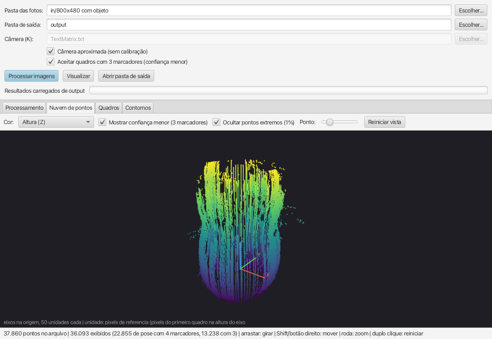</p>
<p align="center">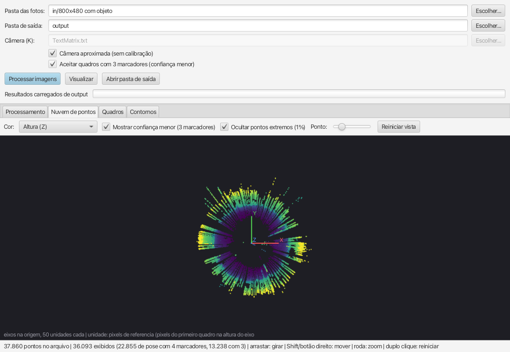</p>
<p align="center"><em>Saída real (fotos de exemplo): perspectiva e vista de cima. As duas lacunas do anel são os ângulos sem quadros.</em></p>

Duas figuras de terceiros mostram o **resultado que se busca** (um objeto real, sua nuvem de pontos e a malha); não foram geradas por este código:

<p align="center">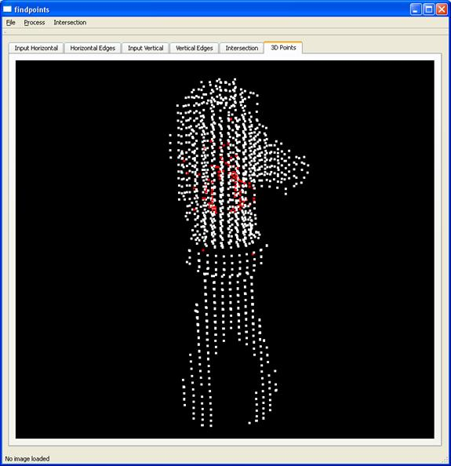</p>
<p align="center">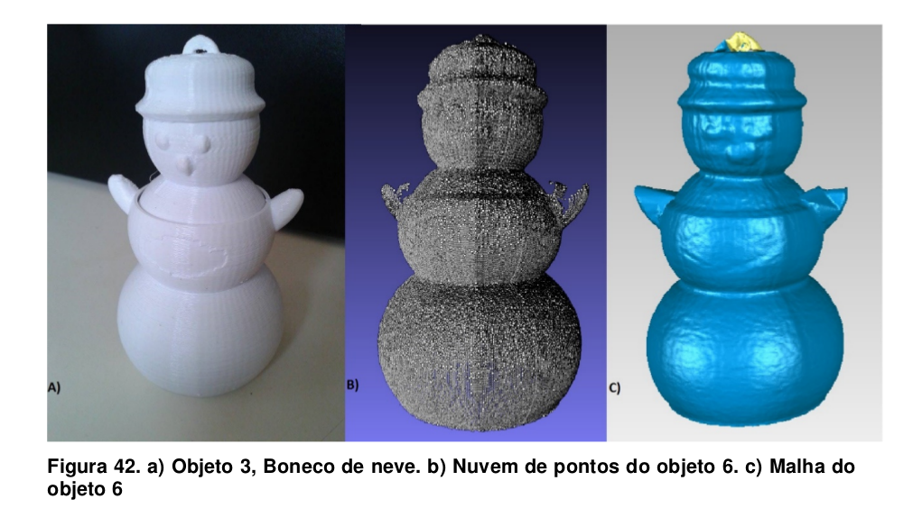</p>

## Quadros com 3 marcadores

Nem sempre os 4 marcadores aparecem: um pode ficar atrás do objeto, fora do quadro ou borrado. Em vez de descartar esses quadros, o programa tenta **recuperar a pose com 3** e a marca como **confiança menor**. Quadros sem 3 marcadores utilizáveis são ignorados, com o motivo no log e em `skipped.txt`.

Com 3 pontos há duas ambiguidades: qual marcador do tipo que aparece uma só vez é ele (o "0" ou o "1") e o P3P devolve até 4 soluções. O programa testa todas as hipóteses e fica com a pose mais próxima da de um **quadro vizinho com 4 marcadores**, descartando poses fisicamente impossíveis (câmera abaixo da folha). Detalhes de implementação em [`PoseEstimator.estimateFromThree`](src/main/java/scan3d/PoseEstimator.java) e [`Pipeline`](src/main/java/scan3d/Pipeline.java):

- A referência precisa estar a até `--max-gap` quadros (padrão 3). A pose só é aceita se ficar a até 60 mm por quadro de distância e 30° da referência.
- Quadros de 3 marcadores já resolvidos servem de referência aos seguintes, em camadas, até 8 saltos. Cada pose vem de um P3P independente (a referência só desempata), então o erro não se acumula.
- Não há erro de reprojeção com 3 pontos (o ajuste é exato), então essa coluna fica vazia; o que há é a distância até a referência.
- A pose (e não a detecção) é o que define onde o objeto pode estar na imagem: o contorno do objeto só vale dentro do volume sobre o retângulo dos marcadores reprojetado com ela, o que funciona também quando um marcador está escondido.

**Como foi validado.** Nos 71 quadros com 4 marcadores e pose boa, escondi um marcador por vez (284 casos) e comparei com a pose de 4 marcadores: em **97%** dos casos a diferença foi menor que 30 mm e 5° (mediana 2,8 mm e 0,5°; p90 9,7 mm e 1,2°). Simulando encadeamento em 7 trechos de 9 quadros consecutivos (28 encadeamentos de 8 saltos), todos ficaram dentro de 30 mm e 5°, com mediana de 1 a 2 mm. **Limites dessa validação:** a referência é a pose de 4 marcadores, não uma medida real; a amostra de encadeamento é pequena; e tudo foi feito com a câmera aproximada. Uma heurística mais simples (decidir a identidade do marcador só pela geometria) acertou apenas 71%, por isso o teste de hipóteses.

Resultado nas 129 fotos de exemplo: **72 quadros com 4 marcadores + 44 com 3 = 116 usados (90%)**, contra 72 (56%) sem essa etapa. Nos 44, a diferença para a referência é de 20 mm (mediana), 56 mm (p90) e 132 mm (máx.). Para usar só quadros completos, passe `--min-markers 4`.

Nas saídas, a confiança aparece como coluna `markers`/`confidence` em `poses.csv`, propriedade `markers` no `cloud.ply`, moldura **laranja** com aviso na foto anotada e cor laranja na GUI.

## Interface gráfica

```bash
./scan3d.sh gui
```

<p align="center">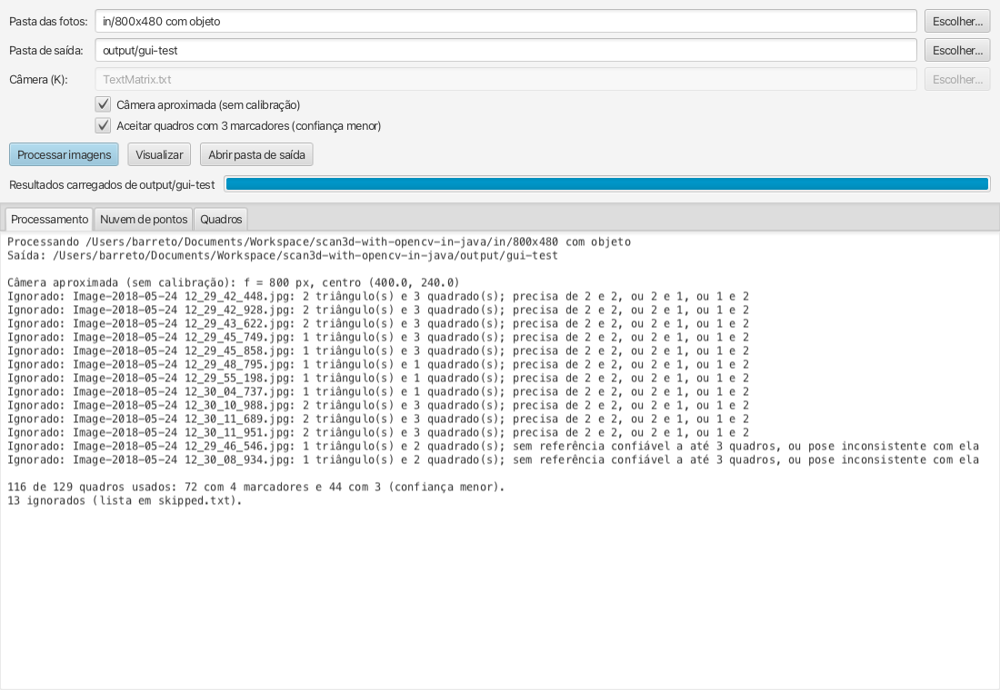</p>

- **Processar imagens**: roda o pipeline em segundo plano, com fase atual, barra de progresso e o log dos quadros ignorados. Se a pasta de saída já tem resultado, pede confirmação antes de substituir. Ao terminar, carrega o resultado.
- **Visualizar**: habilitado quando a pasta de saída já tem `cloud.ply` (por exemplo, de uma execução anterior); abre a nuvem, os quadros e os contornos sem reprocessar.
- **Abrir pasta de saída**: abre a pasta no Finder.
- Opções: pasta das fotos, pasta de saída, câmera aproximada ou arquivo de câmera, e aceitar ou não quadros com 3 marcadores.

A aba **Nuvem de pontos** é um visualizador próprio em JavaFX (sem OpenGL): projeta os pontos com perspectiva num buffer de pixels com z-buffer. Arrastar gira, Shift/botão direito move, a roda dá zoom e duplo clique reinicia. Dá para colorir por altura, por quadro (ordem da volta) ou por confiança da pose, esconder os pontos de 3 marcadores, ocultar os 1% mais extremos e mudar o tamanho do ponto.

<p align="center"></p>

A aba **Quadros** lista todas as fotos (verde = 4 marcadores, laranja = 3, vermelho = ignorado) e mostra a foto anotada e o motivo. Nos quadros com pose, a anotação traz os marcadores, a moldura e os eixos (formas descartadas aparecem em cinza); nos ignorados, traz todas as formas detectadas (triângulos `T` em magenta, quadrados `S` em amarelo), para ver o que o detector enxergou.

<p align="center">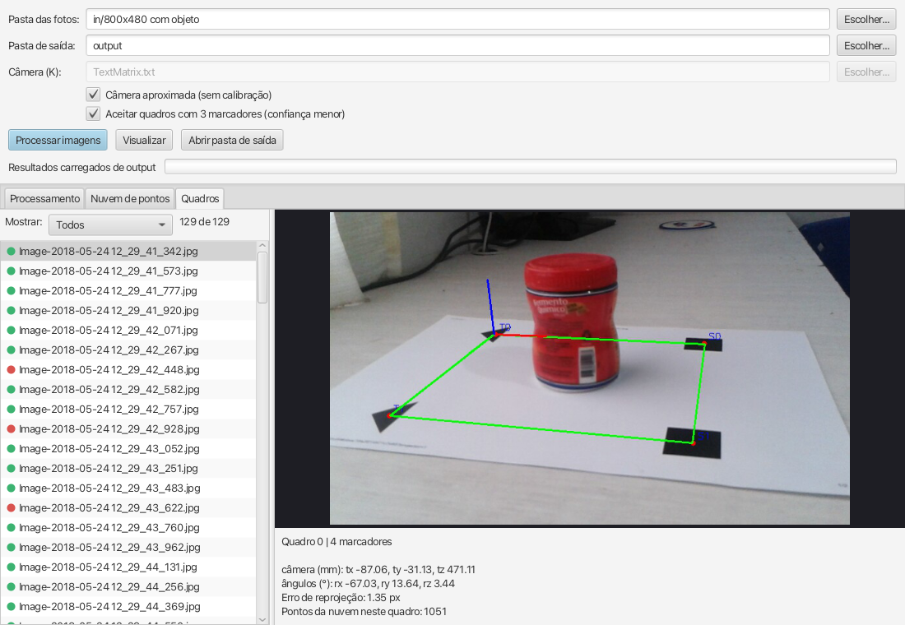</p>

A aba **Contornos** lista os quadros com contorno (o número ao lado é a quantidade de pixels) e mostra o contorno do objeto **sobre a foto** (em vermelho, com a foto escurecida) ou **só o contorno**, em preto e branco, como gravado em `output/contours`. Serve para conferir se ele está sobre o objeto e ver o que entrou junto, como a borda de trás da folha e detalhes do rótulo. Dá para filtrar por confiança da pose (4 ou 3 marcadores).

<p align="center">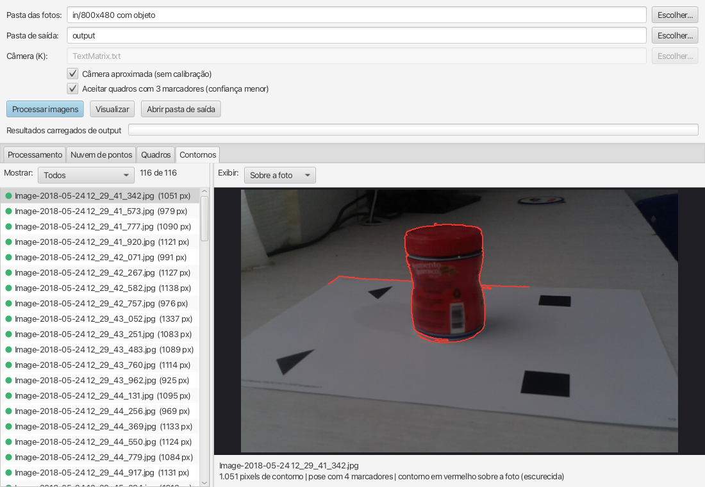</p>

Observações:

- A nuvem exibida é a de lâminas (veja acima). Os eixos e as unidades mostrados são em pixels de referência; o cabeçalho do PLY, exibido na base da janela, traz a escala.
- Ao abrir, o JavaFX imprime `Unsupported JavaFX configuration: classes were loaded from 'unnamed module'`. É um aviso conhecido de rodar o JavaFX pelo classpath (jar único); não afeta o funcionamento.
- Como o JavaFX traz bibliotecas nativas por sistema, o jar gerado por `mvn package` só funciona no sistema em que foi compilado (aqui, macOS ARM64).
- Modos de teste da janela, usados para gerar as capturas acima: `--load` (abre já com os resultados), `--process` (dispara o mesmo caminho do botão) e `--screenshot ARQUIVO --tab N` (grava a captura e fecha; abas: 0 Processamento, 1 Nuvem, 2 Quadros, 3 Contornos).

## O que funciona e o que não funciona

Resultado de `./scan3d.sh scan --approx-camera` sobre as 129 fotos de `in/`:

| Etapa | Estado |
| --- | --- |
| Detecção e ordem dos marcadores | ✅ 72 quadros com 4 marcadores; ordem consistente nos dois lados da volta (24 rotações sintéticas + conferência visual) |
| Quadros com 3 marcadores | ✅ 44 recuperados, marcados como confiança menor (validação e limites em [Quadros com 3 marcadores](#quadros-com-3-marcadores)) |
| Quadros ignorados | 14 de 129, com motivo (115 usados; 6 quadros com 2 triângulos + 3 quadrados foram recuperados descartando a forma a mais). Restam 2 com 1 triângulo e 3 quadrados, 3 com 1 e 1, e 9 com 3 marcadores sem referência confiável |
| Pose | ✅ erro de reprojeção mediano 1,2 px (câmera aproximada); ⚠️ 26 px com o `TextMatrix.txt` original |
| Contorno do objeto | ✅ presente em todos os 116 quadros, contínuo na maioria (mediana de ~1,4 mil pixels); ⚠️ com a borda de trás da folha e detalhes do rótulo em alguns quadros. Reproduz 99% do `out/` |
| Nuvem de pontos | ✅ por lâminas: 37.860 pontos com a forma do pote, raio estável (dispersão de 0,6 a 1,8 mm), cobertura de 296° de 360°; ⚠️ aproximação para objetos que não são de revolução |
| Volta de 360° | ✅ o ângulo `rz` da pose cobre −179° a +180° |
| Interface gráfica e visualizador | ✅ processar, visualizar, navegar quadros (testado via captura de tela; o clique do usuário nos botões não foi exercitado por mim) |

Limitações e pontos de atenção:

- **`K` não combina com as fotos** (calibrada para ~351 × 287, fotos de 800 × 480). Use `--approx-camera` nas fotos de exemplo e recalibre para os testes práticos.
- **Distorção da lente ignorada** (`distCoeffs` = 0). O `calibrate` imprime os coeficientes, mas o pipeline ainda não os usa.
- **A nuvem por lâminas é exata só para objetos de revolução.** Para outros formatos o ponto da borda é posto no plano do eixo, então faces planas ficam "estufadas" e partes côncavas somem. O método geral é o *visual hull*.
- **A qualidade da nuvem depende de `K`.** Com o `TextMatrix.txt` a pose sai imprecisa; as fotos de exemplo foram processadas com a câmera aproximada. Recalibre antes dos testes práticos.
- **Falsos positivos** (uma forma a mais parecida com um marcador): com pelo menos 2 triângulos e 2 quadrados detectados, fica o par de cada tipo cuja razão (distância entre os quadrados)/(distância entre os triângulos) mais se aproxima da mediana dos quadros completos, com tolerância de 30% (a perspectiva desloca a razão). Não cobre o caso de 1 triângulo + 3 quadrados, nem quando duas combinações têm razões parecidas.
- Falhas são esperadas: o programa ignora os quadros que não consegue processar e segue com os demais.

## Do legado ao projeto unificado

Os antigos `Example01` e `Example02` viraram um projeto único, com o **Example02 como base** por ser o mais próximo do objetivo (pose + contorno + nuvem de pontos). Do Example01 vieram a validação rígida de 2+2 marcadores e a ideia de desenhar a pose sobre a foto (`project3d`). O histórico dos dois continua no git.

| Legado | Unificado |
| --- | --- |
| `MainActivity` (caminho fixo `/home/jose/...`) | [`Main`](src/main/java/scan3d/Main.java) com `--in`, `--out`, `--camera`, `--approx-camera`, `--limit` |
| `imgproc1` + `findObjects` + `storesCentroid` | [`MarkerDetector`](src/main/java/scan3d/MarkerDetector.java) |
| `calcSolvepnp` (rvec/tvec descartados) | [`PoseEstimator`](src/main/java/scan3d/PoseEstimator.java) → `Pose`, gravada em `poses.csv` |
| `maskImage` (comentada) | [`ObjectContour`](src/main/java/scan3d/ObjectContour.java) |
| `PointsObjectInFrame` (Jama, `println`, fórmula esférica) | [`LaminaCloudBuilder`](src/main/java/scan3d/LaminaCloudBuilder.java) (lâminas, sem Jama) + [`PlyWriter`](src/main/java/scan3d/PlyWriter.java). A fórmula esférica, em que todos os pontos de um quadro caíam numa reta pela origem, foi substituída |
| `CalibChessBoard.java~` (backup, sem uso) | [`Calibrator`](src/main/java/scan3d/Calibrator.java), comando `calibrate` |
| `Highgui`, `Core.circle/line/putText` (OpenCV 2.4) | `Imgcodecs`, `Imgproc.*` (OpenCV 4.9) |
| Classes JOGL (`MainCvinGL`, `OpenCVImageInGL`, `OpenCVGLTexture`) | **Removidas.** Substituídas pela GUI JavaFX com visualizador próprio ([`CloudView`](src/main/java/scan3d/gui/CloudView.java)) |

Correções feitas no caminho, além de fazer o fluxo funcionar de ponta a ponta:

| Problema no legado | O que mudou |
| --- | --- |
| `listSquares.size() >= 0` sempre verdadeiro; `.get(1)` quebrava | exige exatamente 2 triângulos e 2 quadrados; senão descarta o quadro e informa o motivo |
| Ordem dos marcadores dependia da enumeração de contornos | ordenação por orientação (produto vetorial), válida em qualquer rotação da folha |
| Ex.01 e Ex.02 com modelos 161×187 e 187×161 mm | um só modelo, 187 (X) × 161 (Y); confere com o gabarito |
| `project3d` misturava `x` do quadrado 0 com `y` do quadrado 1 | não foi portado; a sobreposição usa os pontos corretos |
| Centro de cada forma por `minEnclosingCircle`, que num triângulo retângulo cai no meio da hipotenusa | centroide por momentos. No gabarito dá ≈185 mm de espaçamento horizontal (a hipotenusa daria ≈178 mm) contra os 187 mm do modelo |
| Triângulos finos em perspectiva eram rejeitados (razão de áreas) e fundo/código de barras eram aceitos | 3 vértices = triângulo, 4 = quadrado, fechamento morfológico das bordas e teste "escuro por dentro, claro ao redor" |
| "Maior contorno" podia ser um marcador, e o contorno saía fragmentado | bordas antigas (`Canny` 20/100) + recorte pelo volume do objeto reprojetado com a pose (veja [Pipeline](#pipeline) e [Sobre o `out/`](#sobre-o-out)) |
| Ângulos em graus passados a `Math.sin/cos`; `360 - θ` para θ < 0 | (código da fórmula esférica, hoje substituído pelas lâminas; os ângulos passaram a ser calculados como azimute da câmera) |
| Contagem de pixels com `> 150`, preenchimento com `> 200` | (idem: código substituído; o construtor atual não tem esse problema) |
| `readMatCamTxt` lia só a última linha; exigia exatamente 9 valores | lê a última linha não vazia; aceita 9 ou 11 valores |

## Sobre o `out/`

O contorno de `out/` era bem mais definido que o do primeiro projeto unificado. Comparando pixel a pixel com os 10 arquivos e lendo os backups `MainActivity.java~` do histórico do git (a versão do código que gera `.matMask`), o que se sabe:

- **As bordas eram outras.** O backup usa `Canny(cinza, 100, 20)` direto (o OpenCV troca os limiares: efetivamente 20 e 100) e dilatação 2×2. O Example02 tinha passado a fazer `adaptiveThreshold` antes do `Canny`, para achar melhor os marcadores, e eu reaproveitei essas bordas no contorno. Reproduzir só as bordas antigas e o "maior contorno" já cobria **99%** dos pixels do `out/`.
- **Esse resultado vinha com as linhas da borda da folha coladas no pote**, e o `out/` não tem, o que combina com um segundo passo que isola só o objeto central (ele não está no repositório). O `ObjectContour` atual reproduz o efeito com a região reprojetada do objeto, e cobre 99% do `out/` (96 a 100% por quadro, com ~30% de pixels a mais que ficam de fora dele: o `out/` é mais fino e liso). Há um teste que fixa isso.
- **Os 10 arquivos são o melhor caso, não o típico.** São quadros consecutivos do início da sequência (41_573 a 43_251), onde o pote está nítido. Em só ~35% dos quadros o anel de bordas do pote fecha num laço; nos outros o contorno sai aberto.
- O `maskImage` do Example01, cujo `imwrite(".matMask")` está comentado, desenha o contorno **preenchido**; ele não produz a silhueta fina do `out/`.

## Estrutura do repositório

| Caminho | Conteúdo |
| --- | --- |
| [`pom.xml`](pom.xml) | Projeto Maven: Java 21, `org.openpnp:opencv` 4.9 (traz as bibliotecas nativas), JUnit 5 |
| [`src/main/java/scan3d`](src/main/java/scan3d) | Código: detector, pose, contorno, nuvem, PLY (escrita e leitura), calibração, CLI |
| [`src/main/java/scan3d/gui`](src/main/java/scan3d/gui) | Interface gráfica JavaFX: janela, visualizador de nuvem, navegador de quadros |
| [`src/test/java/scan3d`](src/test/java/scan3d) | Testes automatizados |
| [`scan3d.sh`](scan3d.sh) | Compila se preciso e executa (escolhe o JDK 21 do Homebrew) |
| [`in/800x480 com objeto`](in/800x480%20com%20objeto) | 129 fotos de teste (JPG 800×480) de um pote sobre a folha |
| [`out/`](out) | 10 saídas históricas (`*.matMask.jpg`), os melhores quadros do início da sequência. **Não é** a saída do programa atual (veja [Sobre o `out/`](#sobre-o-out)) |
| `output/` | Saída do programa atual (ignorada pelo git): `annotated/`, `contours/`, `poses.csv`, `cloud.ply`, `skipped.txt` |
| [`docs/img`](docs/img) | Figuras usadas neste README |
| [`TextMatrix.txt`](TextMatrix.txt) | Matriz intrínseca original (9 valores, calibrada em outra resolução) |
| [`lib/`](lib) | Legado: `opencv-2413.jar` e `.so` de Linux do OpenCV 2.4. **Não é mais usado** |
| [`install-linux.md`](install-linux.md) | Passo a passo histórico (Ubuntu 16.04, Eclipse Luna, OpenCV 2.4) |
| [`.claude/skills`](.claude/skills) | Skills para o Claude Code |

## Como executar

### Instalação no macOS (feita e testada neste Mac, Apple Silicon)

```bash
brew install openjdk@21 maven
```

O OpenCV **não precisa ser instalado**: o pacote Maven `org.openpnp:opencv` traz a biblioteca nativa (inclusive para macOS ARM64) e o programa a extrai sozinho. O JDK 21 do Homebrew é *keg-only*, então o `scan3d.sh` já o localiza; para usá-lo no terminal:

```bash
echo 'export JAVA_HOME=/opt/homebrew/opt/openjdk@21' >> ~/.zshrc
```

Nada foi alterado no `~/.zshrc` automaticamente.

### Executar

```bash
./scan3d.sh gui                           # janela: Processar imagens / Visualizar
./scan3d.sh scan --approx-camera          # linha de comando: fotos de exemplo, K aproximada; saída em output/
./scan3d.sh scan --in MINHA_PASTA --camera MINHA_CAMERA.txt --out output/teste1
./scan3d.sh scan --approx-camera --min-markers 4   # só quadros com os 4 marcadores
./scan3d.sh calibrate --in FOTOS_TABULEIRO --pattern 8x6 --square 50   # grava TextMatrix.txt
./scan3d.sh --help
```

O primeiro `scan3d.sh` compila (baixa dependências e gera um jar de ~120 MB, pois embute as bibliotecas nativas do OpenCV de todos os sistemas e as do JavaFX do sistema atual). Opções de `scan`: `--in`, `--out`, `--camera`, `--approx-camera`, `--limit N`, `--min-markers 3|4` (padrão 3) e `--max-gap N` (padrão 3). Saída:

| Arquivo | Conteúdo |
| --- | --- |
| `output/annotated/*.jpg` | foto com marcadores, IDs, moldura do modelo e eixos da pose |
| `output/contours/*.png` | contorno do objeto |
| `output/poses.csv` | por quadro: `markers` (4 ou 3) e `confidence` (`high`/`low`), `tx, ty, tz` (mm), `rx, ry, rz` (graus), erro de reprojeção (px; vazio com 3 marcadores), `ref_frame`, `ref_hops`, `ref_dist_mm` (só com 3) e nº de pontos |
| `output/cloud.ply` | nuvem acumulada, com as propriedades `frame` e `markers` |
| `output/skipped.txt` | um quadro ignorado por linha, com o motivo |

O erro de reprojeção (`reproj_rms_px`) é o melhor indicador rápido: valores de poucos pixels indicam marcadores certos e `K` coerente; dezenas de pixels indicam `K` errada.

### Para os testes práticos

1. Fotografe um **tabuleiro de xadrez** impresso (ex.: 8×6 cantos internos, quadrados de 50 mm) em 15 ou mais posições, **na mesma resolução** que usará para o objeto, e rode `calibrate`.
2. Imprima o gabarito ([`docs/img/imagem-base-referencia-coordenada.png`](docs/img/imagem-base-referencia-coordenada.png)) em A4 **sem escala/ajuste de página** e confira com régua os 187 × 161 mm entre os centros dos marcadores; se diferir, altere `WIDTH_MM`/`HEIGHT_MM` em [`PoseEstimator`](src/main/java/scan3d/PoseEstimator.java).
3. Sempre que der, deixe **os quatro marcadores visíveis** em cada foto e o objeto no centro, sem cobrir nenhum. Quadros com 3 ainda servem (confiança menor), mas com menos que isso o quadro é ignorado. Para o encadeamento funcionar, fotografe em sequência com a câmera se movendo pouco entre fotos (aqui, ~6 mm por quadro).
4. Use luz difusa: sombras e reflexos quebram os contornos.

### Testes

```bash
JAVA_HOME=/opt/homebrew/opt/openjdk@21 mvn test
```

São 11 testes: ordenação dos marcadores em 24 rotações; recuperação de uma pose sintética conhecida (erro < 0,01 px); recuperação com 3 marcadores, escondendo cada um por vez; rejeição de referência distante; contagem de marcadores parciais; detecção em uma foto real de `in/`; leitura/escala do arquivo da câmera; ida e volta do PLY; o contorno do objeto contra o `out/` (deve reproduzir ≥ 90% dele); e um cilindro sintético (raio, altura, centro deslocado e câmera em distâncias diferentes) que a nuvem por lâminas deve devolver com o mesmo raio em todos os ângulos. A GUI foi verificada por capturas de tela, sem teste automatizado. O comando `calibrate` **não foi exercitado com fotos reais** (não há fotos de tabuleiro no repositório); só o tratamento de erro sem imagens foi conferido.

## Próximos passos

Em ordem de retorno sobre esforço:

1. **Recalibrar** na resolução real e passar os `distCoeffs` ao `solvePnP` e à inversão.
2. **Visual hull** (interseção das silhuetas esticadas) para objetos que não são de revolução; a lâmina infla faces planas e perde concavidades. Precisa de silhueta preenchida (item 3).
3. **Segmentar o objeto contra o papel branco** (limiar/GrabCut dentro da região reprojetada) para obter uma silhueta **preenchida**, necessária ao *visual hull* e sem as linhas da borda da folha que ainda escapam do contorno atual.
4. **Formas a mais com 1 triângulo ou 1 quadrado** (2 quadros hoje): a razão de distâncias não existe; seria preciso outro critério, como o erro de reprojeção de cada combinação.
5. Filtrar/ponderar pontos de quadros de confiança menor na reconstrução (a GUI já permite escondê-los) e medir o efeito com fotos reais.
6. Portar para Android (OpenCV Android + a mesma lógica), depois de validar a matemática.

## Skills para o Claude Code

Em [`.claude/skills`](.claude/skills) há skills que carregam este contexto sob demanda:

| Skill | Use para |
| --- | --- |
| `scan3d-opencv-java` | Visão geral, mapa do código e roteiro de investigação |
| `scan3d-pose-geometry` | Explicar `K`, `[R\|t]`, `solvePnP`, P3P com 3 marcadores e a nuvem por lâminas, e checar a matemática do código |
| `scan3d-legacy-run-port` | Rodar, depurar e evoluir o projeto no macOS; histórico do legado e portabilidade |
