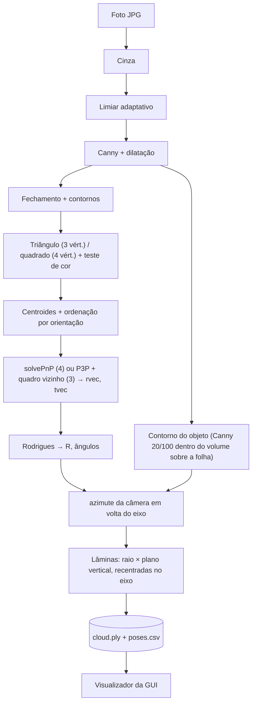

# Reconstrução Tridimensional com OpenCV

Este trabalho apresenta um protótipo para a reconstrução tridimensional de objetos a partir de um conjunto de fotografias capturadas ao seu redor, utilizando apenas uma câmera convencional e uma folha A4 impressa com um marcador de referência espacial. A implementação original foi desenvolvida em Java com a biblioteca OpenCV 2.4 e, posteriormente, portada para a versão 4.9.

<p align="center">
  
  
</p>
<p align="center"><em>Par de imagens com aproximadamente 180° de diferença angular entre si. T0/S0/T1/S1 identificam os marcadores detectados; o retângulo verde corresponde ao modelo reprojetado a partir da pose estimada; os eixos X (vermelho), Y (verde) e Z (azul) indicam o sistema de coordenadas do marcador.</em></p>

<p align="center"></p>

> Conforme ilustrado na imagem acima, a interface gráfica reúne os controles principais — “Processar imagens” e “Visualizar” — além de recursos para análise dos resultados. A nuvem de pontos é construída por **lâminas** (cada contorno é convertido em um plano vertical rotacionado segundo o ângulo estimado da câmera), resultando em um raio estável (dispersão de aproximadamente 1 a 2 mm). O método é exato para objetos de revolução e aproximado para os demais casos. Ver [Resultados e limitações](#resultados-e-limitações).

## Sumário

1. [Visão geral](#visão-geral)
2. [O marcador de referência](#o-marcador-de-referência)
3. [Fluxograma do processo](#fluxograma-do-processo)
4. [Fundamentos: câmera, calibração e pose](#fundamentos-câmera-calibração-e-pose)
5. [Da silhueta à nuvem 3D (lâminas)](#da-silhueta-à-nuvem-3d-lâminas)
6. [Quadros com 3 marcadores](#quadros-com-3-marcadores)
7. [Interface gráfica](#interface-gráfica)
8. [Resultados e limitações](#resultados-e-limitações)
9. [Estrutura do repositório](#estrutura-do-repositório)
10. [Instalação e execução](#instalação-e-execução)
11. [Trabalhos futuros](#trabalhos-futuros)

## Visão geral

O objeto de interesse é posicionado no centro de uma folha A4. A câmera realiza um percurso de aproximadamente **360°** ao seu redor, capturando um quadro a intervalos de poucos graus. Para cada quadro, o método executa as seguintes etapas:

1. o **marcador** impresso na folha determina a posição e a orientação da câmera (a *pose*);
2. o **contorno do objeto** é isolado na imagem;
3. cada pixel do contorno, conhecida a pose, é convertido em coordenadas do mundo real (mm);
4. o conjunto de pontos de todos os quadros compõe a **nuvem de pontos tridimensional**.

Segundo a taxonomia de técnicas de aquisição 3D, trata-se de uma técnica **óptica passiva** (câmera única, sem projeção de luz estruturada), correspondendo, na prática, a uma variação do método *Shape from Silhouette* ([Temporal Shape-From-Silhouette](https://www.cs.cmu.edu/~german/research/TSFS/tsfs.html)). O modelo geométrico é obtido a partir dos contornos observados sob múltiplos ângulos de vista.

<p align="center"></p>

## O marcador de referência

O marcador é composto por **dois triângulos e dois quadrados pretos (≈ 2 × 2 cm)** posicionados nos cantos de uma folha A4 em orientação paisagem, com o objeto disposto no centro. O gabarito utilizado está disponível em [`docs/img/A4-base-scan3D.png`](docs/img/A4-base-scan3D.png) (3508×2480 px, equivalente a A4 a 300 dpi); o diagrama polar de 0° a 360°, inserido ao centro, serve de referência para o ângulo de captura de cada fotografia.

<p align="center">
  
  
</p>

Os quatro centroides constituem os pontos de correspondência 3D↔2D utilizados pela função `solvePnP`. Assume-se o plano da folha como `Z = 0`, com os triângulos dispostos na coluna esquerda e os quadrados na direita:

```text
   tri0 (0, 0)      ────── 187 mm ──────   sq0 (187, 0)
        │                                       │
      161 mm                                  161 mm
        │                                       │
   tri1 (0, 161)    ────── 187 mm ──────   sq1 (187, 161)
```

As medições realizadas sobre o gabarito (folha A4, 297 × 210 mm) indicam, a partir do centroide dos triângulos, um espaçamento horizontal de aproximadamente 185 mm e vertical de 160 mm, valores coerentes com os 187 × 161 mm adotados no modelo. O centro do círculo circunscrito mínimo, por sua vez, recai no ponto médio da hipotenusa, resultando em uma distância aproximada de 178 mm.

## Fluxograma do processo



| Etapa | Método OpenCV | Classe |
| --- | --- | --- |
| Bordas | `cvtColor` → `adaptiveThreshold` (MEAN) → `Canny` → `dilate` | [`MarkerDetector.edges`](src/main/java/scan3d/MarkerDetector.java) |
| Formas | `morphologyEx(CLOSE)` → `findContours` → `approxPolyDP` → `isContourConvex` + teste escuro/claro | `MarkerDetector.detect` |
| Centros e ordem | `moments` (centroide) e produto vetorial | `MarkerDetector.order` |
| Pose | `Calib3d.solvePnP`, `projectPoints` (erro), `Rodrigues` | [`PoseEstimator`](src/main/java/scan3d/PoseEstimator.java) |
| Contorno do objeto | `Canny` 20/100 direto do cinza, recorte pelo volume do objeto reprojetado, `findContours` + `drawContours` | [`ObjectContour`](src/main/java/scan3d/ObjectContour.java) |
| Contorno → 3D | raio de cada pixel intersectado com o plano da lâmina; extremos por altura | [`LaminaCloudBuilder`](src/main/java/scan3d/LaminaCloudBuilder.java) |
| Saída | PLY ASCII, CSV, imagens | [`PlyWriter`](src/main/java/scan3d/PlyWriter.java), [`Pipeline`](src/main/java/scan3d/Pipeline.java) |
| Calibração | `findChessboardCorners` → `calibrateCamera` | [`Calibrator`](src/main/java/scan3d/Calibrator.java) |

<p align="center"></p>
<p align="center"><em>Ilustração esquemática da sequência cor → tons de cinza → detecção de bordas (figura ilustrativa; não constitui saída real do sistema).</em></p>

**Detecção do marcador.** A determinação da sequência `tri0, sq0, tri1, sq1` não depende mais da ordem de enumeração dos contornos. Como o marcador pode aparecer em qualquer rotação ao longo de uma volta de 360° (na metade do percurso os quadrados aparecem à esquerda), o algoritmo utiliza um critério de orientação: como a câmera observa a folha de cima, o produto vetorial entre o eixo triângulo→quadrado e o eixo entre as duas formas de mesmo tipo apresenta sinal constante, permitindo identificar univocamente qual conjunto corresponde a "0" e qual corresponde a "1". Quadros com os quatro marcadores fornecem a estimativa de pose de maior qualidade; com três marcadores, a pose é recuperada por um procedimento alternativo (ver seção seguinte); com menos de três, o quadro é **descartado**.

A extração do contorno do objeto, implementada em [`ObjectContour`](src/main/java/scan3d/ObjectContour.java), utiliza uma imagem de bordas distinta daquela empregada na detecção dos marcadores: aplica-se o operador de Canny diretamente sobre a imagem em tons de cinza (limiares 20 e 100), seguido de dilatação morfológica 2×2. A etapa de `adaptiveThreshold` que precede o `Canny` na detecção de marcadores é adequada a essa finalidade, mas fragmenta o contorno do objeto quando aplicada da mesma forma. Delimita-se, então, uma região de interesse correspondente à área interna aos pontos de referência, o que elimina o fundo da cena, os próprios marcadores e as linhas de borda da folha. Entre os contornos remanescentes, seleciona-se o componente de maior extensão, acrescido de uma faixa estreita ao seu redor. **Limitações:** o objeto deve caber no retângulo definido pelos marcadores e não exceder 250 mm de altura; adicionalmente, a **borda posterior da folha** ainda é capturada em alguns quadros, por situar-se na mesma linha de visada do objeto.

<p align="center"></p>
<p align="center"><em>Representação esquemática do conceito de máscara (imagem ilustrativa; a saída real do sistema corresponde à silhueta fina em <code>output/contours</code>).</em></p>

## Fundamentos: câmera, calibração e pose

### Modelo pinhole

<p align="center">
  
  
</p>

A projeção de um ponto tridimensional `(X, Y, Z)` sobre o pixel `(u, v)` é modelada pela câmera pinhole segundo a equação:

```text
s · [u v 1]ᵀ = K · [R | t] · [X Y Z 1]ᵀ

        [ fx   0  cx ]
    K = [  0  fy  cy ]      intrínsecos: dependem só da câmera/lente
        [  0   0   1 ]

    [R | t]                 extrínsecos: dependem da posição da câmera em cada foto
```

- `fx, fy` correspondem à distância focal expressa em **pixels**; `(cx, cy)` denota o ponto principal, geralmente coincidente com o centro da imagem.
- O redimensionamento da imagem altera `fx, fy, cx, cy` na mesma proporção.

<p align="center">
  
  
</p>

Por semelhança de triângulos, sendo `P` a largura em pixels, `W` a largura real do objeto e `D` a distância até a câmera, obtém-se `F = (P · D) / W`. Essa relação permite estimar uma distância isolada, mas **não substitui a função `solvePnP`**, que utiliza múltiplos pontos de correspondência e retorna a pose completa da câmera.

### Intrínsecos: `TextMatrix.txt`

Os valores da matriz intrínseca provêm de uma calibração realizada em 2017. Na implementação original, o programa apenas imprimia a matriz, cujos valores eram transcritos manualmente o arquivo. Essa etapa foi automatizada por meio do comando `calibrate` (ver [Instalação e execução](#instalação-e-execução)), que atualmente grava o arquivo de forma autônoma e, no formato estendido de 11 valores, também registra a resolução utilizada na calibração:

```text
fx, 0, cx, 0, fy, cy, 0, 0, 1
378.8464, 0, 175.5, 0, 378.8464, 143.5, 0, 0, 1                 (original, 9 valores)
fx, 0, cx, 0, fy, cy, 0, 0, 1, largura, altura                   (novo, 11 valores)
```

<p align="center"></p>
<p align="center"><em>Padrão de calibração (chessboard) utilizado no projeto e disponível em <code>docs/img</code></em></p>

> Ao utilizar os valores atuais de `TextMatrix.txt` para processar as imagens de `/in`, o erro de reprojeção mediano é de **26 px** (máximo de 47 px), porém esse erro pode ser reduzido para **1,2 px** quando aplicado valores aproximados (`--approx-camera`: `f` igual à largura da imagem, ponto principal no centro). Por esse motivo, o programa emite um aviso quando `K` não corresponde à resolução das fotografias, sendo a recalibração na resolução real da câmera a etapa mais relevante antes da realização de testes práticos.

### Extrínsecos: `solvePnP`

<p align="center"></p>

Para cada fotografia, a função `solvePnP(objectPoints, imagePoints, K, distCoeffs)`, implementada em [`PoseEstimator`](src/main/java/scan3d/PoseEstimator.java), recebe como parâmetros:

- `objectPoints`: as coordenadas dos quatro centros do marcador no referencial do mundo, em mm, com `Z = 0` (conforme tabela anterior);
- `imagePoints`: as coordenadas dos quatro centros detectados na imagem, em pixels;
- `distCoeffs`: atualmente **nulo**, isto é, os efeitos de distorção da lente não são considerados.

A função retorna o vetor de rotação `rvec` (representação de Rodrigues) e o vetor de translação `tvec` (em mm), que constituem os **parâmetros extrínsecos** daquele quadro. A conversão de `rvec` para a matriz de rotação `R` (3×3) é realizada por `Calib3d.Rodrigues(rvec)`.

<p align="center">
  
  
</p>
<p align="center"><em>À direita, exemplo de pose estimada e respectiva reprojeção. Procedimento análogo é realizado pelo sistema em <code>output/annotated</code>, no qual a moldura do modelo e os eixos de coordenadas são sobrepostos à imagem da folha.</em></p>

### Ângulos

`PoseEstimator` extrai os ângulos de Euler (convenção Z-Y-X) a partir de `R` e os registra em `poses.csv`. O ângulo de rotação de cada quadro em torno do objeto, contudo, não corresponde a nenhum desses três ângulos: trata-se do **azimute da câmera** em relação ao centro da folha, calculado a partir de `R` e `t` em [`LaminaCloudBuilder`](src/main/java/scan3d/LaminaCloudBuilder.java).

<p align="center">
  
  
</p>

## Da silhueta à nuvem 3D (lâminas)

O princípio do método consiste em tratar o contorno de cada fotografia como uma **lâmina bidimensional vertical**, situada no plano que contém o eixo de rotação (Z, passando pelo centro da folha), rotacionada segundo o ângulo estimado da câmera naquele quadro. O conjunto das lâminas compõe o objeto reconstruído. A implementação encontra-se em [`LaminaCloudBuilder`](src/main/java/scan3d/LaminaCloudBuilder.java) e compreende as seguintes etapas:

1. **Ângulo.** Corresponde ao azimute da câmera em torno do centro da folha, derivado da pose e tomado em relação ao primeiro quadro, fixado em 0°. Como a captura é realizada com a câmera empunhada manualmente, os incrementos angulares reais são irregulares, não sendo assumido um passo fixo de 1° ou 2°.
2. **Posição e escala.** Cada pixel do contorno é projetado como um raio a partir do centro óptico da câmera e intersectado com o plano da lâmina correspondente. Esse procedimento trata simultaneamente a perspectiva e a inclinação da câmera, normalizando a escala: embora a escala aparente da imagem varie com a distância (quase o dobro, nas fotografias de exemplo) e com a altura (pontos mais elevados aparentam estar mais próximos), um objeto de mesmas dimensões produz o mesmo tamanho em qualquer quadro após a correção.
3. **Unidade.** A nuvem resultante é expressa em **pixels de referência** (definidos pelo pixel do primeiro quadro na altura do eixo), sem conversão direta para milímetros. Trata-se de uma mudança de unidade de fator constante — portanto linear —, sendo o fator de conversão (pixels por mm da folha) registrado no cabeçalho do arquivo PLY para eventual conversão posterior.
4. **Silhueta externa.** Para cada faixa de altura, consideram-se apenas os pontos extremos, esquerdo e direito, do contorno. Bordas internas (como as do rótulo) são descartadas, assim como picos isolados (por exemplo, a borda da folha em contato com o objeto). O topo e a base do objeto são deliberadamente excluídos, pois, com a câmera posicionada acima do objeto, as elipses correspondentes a essas regiões aparecem deslocadas em altura.
5. **Centro do objeto.** O método pressupõe que o objeto esteja centrado sobre o eixo de rotação; observa-se, no entanto, um deslocamento de poucos milímetros em relação ao centro da folha (~7 mm nas fotografias de exemplo), o que introduz distorção na projeção. Como o centro permanece fixo, a média dos extremos esquerdo e direito em cada quadro equivale a `e·t`; o deslocamento `e` é estimado por regressão robusta de mínimos quadrados sobre o conjunto de quadros, permitindo recentralizar o objeto no eixo. Essa correção reduziu a dispersão do raio por faixa de altura de aproximadamente 11 mm para 1–2 mm.
6. **Fechamento angular.** Cada lâmina é bilateral, isto é, definida em relação a ambos os lados do eixo, de modo que a vista do lado oposto recai sobre o mesmo plano com a silhueta espelhada. O espelhamento das lâminas não introduz, portanto, pontos adicionais: um intervalo de azimutes de amplitude A cobre aproximadamente 2·A graus em torno do eixo. O programa calcula e reporta essa cobertura angular.

No conjunto de fotografias de exemplo (azimutes de −86° a +80°, amplitude de ~166°, não 360°), obtiveram-se 37.860 pontos, com cobertura de **296° dos 360°** (o restante corresponde a lacunas entre quadros) e raio entre 29 e 31 mm, com dispersão de 0,6 a 1,8 mm por faixa de altura, incluindo os quadros de confiança reduzida. O perfil resultante apresenta uma região de "cintura" (~29 mm, entre 30 e 50 mm de altura) e "ombros" (~31 mm), compatível com a geometria do objeto fotografado (um pote).

**Limitações.** O método é exato para objetos de revolução, nos quais a largura da silhueta corresponde diretamente ao raio, como no caso do objeto utilizado como exemplo. Para geometrias distintas, trata-se de uma aproximação: o ponto de borda é posicionado no plano do eixo, quando na realidade poderia estar deslocado à frente ou atrás, o que faz com que faces planas apareçam "infladas" e regiões côncavas não sejam capturadas. O método geral subjacente é o ***visual hull*** (interseção de silhuetas estendidas ao longo da linha de visada). Adicionalmente, o objeto deve permanecer aproximadamente centrado sobre a folha: o desvio fixo é corrigido pelo algoritmo, mas deslocamentos do objeto durante a captura não são.

<p align="center">
  
  
</p>
<p align="center"><em>Saída real do sistema (fotografias de exemplo), em vista de perspectiva e vista superior. As lacunas observadas correspondem aos intervalos angulares sem quadros correspondentes.</em></p>

As figuras a seguir ilustram o tipo de resultado almejado — um objeto real, sua nuvem de pontos e a malha correspondente —, obtidos por meio de outros métodos, a título de referência:

<p align="center"></p>
<p align="center"></p>

## Quadros com 3 marcadores

Nem sempre os quatro marcadores são visíveis simultaneamente: um deles pode estar oculto pelo objeto, fora do enquadramento ou desfocado. Em vez de descartar tais quadros, o sistema procura recuperar a pose a partir de **três marcadores**, atribuindo-lhes o rótulo de confiança reduzida. Quadros sem, ao menos, três marcadores utilizáveis são descartados, com o motivo correspondente registrado no log e no arquivo `skipped.txt`.

A utilização de apenas três pontos introduz duas fontes de ambiguidade: a identidade ("0" ou "1") do marcador de um tipo que aparece uma única vez, e a multiplicidade de soluções do problema P3P (*Perspective-3-Point*), que pode retornar até quatro soluções distintas. O sistema testa exaustivamente todas as hipóteses e seleciona a pose mais próxima à de um **quadro vizinho com quatro marcadores**, descartando soluções fisicamente inválidas. Os detalhes de implementação constam em [`PoseEstimator.estimateFromThree`](src/main/java/scan3d/PoseEstimator.java) e [`Pipeline`](src/main/java/scan3d/Pipeline.java):

- A referência utilizada deve estar a, no máximo, `--max-gap` quadros de distância (padrão: 3). A pose somente é aceita caso não exceda 60 mm por quadro de distância e 30° de diferença angular em relação à referência.
- Quadros de três marcadores já resolvidos podem servir de referência para os quadros subsequentes, em camadas sucessivas, até um limite de 8 saltos. Como cada pose deriva de uma solução P3P independente — a referência atua apenas como critério de desempate —, o erro não se acumula ao longo da cadeia.
- Não há erro de reprojeção associado a soluções com três pontos, uma vez que o ajuste é exato; nesse caso, a coluna correspondente permanece vazia, sendo substituída pela distância até a referência.
- A pose que determina a região da imagem em que o objeto pode se encontrar: o contorno do objeto é considerado válido apenas dentro do volume delimitado pelo retângulo dos marcadores reprojetado segundo essa pose, o que permanece válido mesmo quando um dos marcadores está oculto.

Uma heurística mais simples, baseada exclusivamente em critérios geométricos para determinar a identidade do marcador, obteve uma taxa de acerto de apenas 71%, o que motivou a adoção do procedimento de teste de hipóteses descrito acima.

Das 129 fotografias de exemplo, obtiveram-se 72 quadros com quatro marcadores e 44 com três, totalizando **116 quadros aproveitados (90%)**. Entre os 44 quadros recuperados, a diferença em relação à referência é de 20 mm (mediana), 56 mm (percentil 90) e 132 mm (máximo). Para restringir o processamento apenas a quadros completos, utiliza-se a opção `--min-markers 4`.

Nas saídas do sistema, o nível de confiança é registrado na coluna `markers`/`confidence` de `poses.csv` e na propriedade `markers` de `cloud.ply`, sendo destacado em **laranja**, com aviso correspondente, tanto na fotografia anotada quanto na interface gráfica.

## Interface gráfica

```bash
./scan3d.sh gui
```

<p align="center"></p>

- **Processar imagens**: executa o pipeline em segundo plano, exibindo a fase corrente, uma barra de progresso e o log dos quadros descartados. Caso a pasta de saída já contenha resultados, solicita confirmação antes de sobrescrevê-los; ao término, carrega automaticamente o resultado obtido.
- **Visualizar**: habilitado quando a pasta de saída já contém um arquivo `cloud.ply` (por exemplo, de uma execução anterior); permite abrir a nuvem, os quadros e os contornos sem necessidade de reprocessamento.
- **Abrir pasta de saída**: abre a pasta correspondente no Finder.
- Opções disponíveis: pasta de origem das fotografias, pasta de saída, uso de câmera aproximada ou de arquivo de calibração, e aceitação (ou não) de quadros com três marcadores.

A aba **Nuvem de pontos** consiste em um visualizador próprio, implementado em JavaFX sem uso de OpenGL, que projeta os pontos em perspectiva sobre um buffer de pixels com teste de profundidade (*z-buffer*). A interação inclui rotação por arraste do mouse, deslocamento via Shift ou botão direito, zoom pela roda do mouse e reinicialização por duplo clique. É possível colorir os pontos por altura, por quadro (ordem de captura ao longo da volta) ou por confiança da pose, além de ocultar os pontos provenientes de quadros com três marcadores, filtrar o 1% de pontos mais extremos e ajustar o tamanho de exibição dos pontos.

<p align="center"></p>

A aba **Quadros** apresenta a listagem completa das fotografias (verde: quatro marcadores; laranja: três marcadores; vermelho: quadro descartado), exibindo a imagem anotada e o motivo do descarte, quando aplicável. Para quadros com pose estimada, a anotação inclui os marcadores, a moldura do modelo e os eixos de coordenadas (formas descartadas são exibidas em cinza); para quadros descartados, são exibidas todas as formas detectadas (triângulos em magenta, identificados por `T`; quadrados em amarelo, identificados por `S`), permitindo a verificação do que foi identificado pelo detector.

<p align="center"></p>

A aba **Contornos** lista os quadros para os quais foi extraído um contorno (o número exibido ao lado indica a quantidade de pixels) e permite visualizar o contorno do objeto sobreposto à fotografia (em vermelho, com a imagem escurecida) ou isoladamente, em preto e branco, tal como gravado em `output/contours`. Essa visualização possibilita verificar a correspondência entre o contorno e o objeto, bem como identificar elementos indevidamente incluídos, como a borda posterior da folha e detalhes do rótulo.

<p align="center"></p>

## Resultados e limitações

Resultados obtidos pela execução de `./scan3d.sh scan --approx-camera` sobre o conjunto de 129 fotografias em `in/`:

| Etapa | Estado |
| --- | --- |
| Detecção e ordem dos marcadores | ✅ 72 quadros com 4 marcadores; ordem consistente nos dois lados da volta (24 rotações sintéticas + conferência visual) |
| Quadros com 3 marcadores | ✅ 44 recuperados, marcados como confiança menor (validação e limites em [Quadros com 3 marcadores](#quadros-com-3-marcadores)) |
| Quadros ignorados | 14 de 129, com motivo (115 usados; 6 quadros com 2 triângulos + 3 quadrados foram recuperados descartando a forma a mais). Restam 2 com 1 triângulo e 3 quadrados, 3 com 1 e 1, e 9 com 3 marcadores sem referência confiável |
| Pose | ✅ erro de reprojeção mediano 1,2 px (câmera aproximada); ⚠️ 26 px com o `TextMatrix.txt` original |
| Contorno do objeto | ✅ presente em todos os 116 quadros, contínuo na maioria (mediana de ~1,4 mil pixels); ⚠️ com a borda de trás da folha e detalhes do rótulo em alguns quadros |
| Nuvem de pontos | ✅ 37.860 pontos com a forma do pote, raio estável (dispersão de 0,6 a 1,8 mm), cobertura de 296° de 360°; ⚠️ aproximação para objetos que não são de revolução |
| Volta de 360° | ✅ o ângulo `rz` da pose cobre −179° a +180° |
| Interface gráfica e visualizador | ✅ processar, visualizar, navegar quadros (testado via captura de tela; a interação direta do usuário com os botões não foi exercitada pelo autor) |

Limitações e pontos de atenção:

- Recomenda-se o uso de `--approx-camera` para as fotografias de exemplo, sendo a recalibração necessária para testes práticos.
- **A distorção da lente não é considerada** (`distCoeffs` = 0). O comando `calibrate` calcula e imprime os coeficientes correspondentes, mas o pipeline ainda não os incorpora ao processamento.
- **A nuvem obtida pelo método de lâminas é exata apenas para objetos de revolução.** Para outras geometrias, o ponto de borda é posicionado no plano do eixo, o que faz com que faces planas apareçam infladas e regiões côncavas não sejam representadas. O método geral correspondente é o *visual hull*.
- **A qualidade da nuvem resultante depende diretamente da precisão de `K`.** Com o arquivo `TextMatrix.txt` original, a pose estimada apresenta imprecisão considerável; as fotografias de exemplo foram processadas com câmera aproximada. Recomenda-se a recalibração antes da realização de testes práticos.
- Falhas pontuais são esperadas: o sistema descarta os quadros que não consegue processar corretamente e prossegue com os demais.

## Estrutura do repositório

| Caminho | Conteúdo |
| --- | --- |
| [`pom.xml`](pom.xml) | Projeto Maven: Java 21, `org.openpnp:opencv` 4.9 (traz as bibliotecas nativas), JUnit 5 |
| [`src/main/java/scan3d`](src/main/java/scan3d) | Código: detector, pose, contorno, nuvem, PLY (escrita e leitura), calibração, CLI |
| [`src/main/java/scan3d/gui`](src/main/java/scan3d/gui) | Interface gráfica JavaFX: janela, visualizador de nuvem, navegador de quadros |
| [`src/test/java/scan3d`](src/test/java/scan3d) | Testes automatizados |
| [`scan3d.sh`](scan3d.sh) | Compila se preciso e executa (escolhe o JDK 21 do Homebrew) |
| [`in/800x480 com objeto`](in/800x480%20com%20objeto) | 129 fotos de teste (JPG 800×480) de um pote sobre a folha |
| [`out/`](out) | 10 saídas históricas (`*.matMask.jpg`), os melhores quadros do início da sequência. **Não é** a saída do programa atual |
| `output/` | Saída do programa atual (ignorada pelo git): `annotated/`, `contours/`, `poses.csv`, `cloud.ply`, `skipped.txt` |
| [`docs/img`](docs/img) | Figuras utilizadas neste documento |
| [`TextMatrix.txt`](TextMatrix.txt) | Matriz intrínseca original (9 valores, calibrada em outra resolução) |
| [`lib/`](lib) | Legado: `opencv-2413.jar` e `.so` de Linux do OpenCV 2.4. **Não é mais utilizado** |
| [`install-linux.md`](install-linux.md) | Passo a passo histórico (Ubuntu 16.04, Eclipse Luna, OpenCV 2.4) |

## Instalação e execução

### Instalação no macOS

```bash
brew install openjdk@21 maven
```

A instalação do OpenCV **não é necessária**: o pacote Maven `org.openpnp:opencv` inclui a biblioteca nativa correspondente (inclusive para macOS ARM64), sendo esta extraída automaticamente pelo programa. Como o JDK 21 distribuído pelo Homebrew é *keg-only*, o script `scan3d.sh` já realiza sua localização automaticamente; para utilizá-lo diretamente no terminal:

```bash
echo 'export JAVA_HOME=/opt/homebrew/opt/openjdk@21' >> ~/.zshrc
```

Nenhuma alteração é realizada automaticamente no arquivo `~/.zshrc`.

### Execução

```bash
./scan3d.sh gui                           # janela: Processar imagens / Visualizar
./scan3d.sh scan --approx-camera          # linha de comando: fotos de exemplo, K aproximada; saída em output/
./scan3d.sh scan --in MINHA_PASTA --camera MINHA_CAMERA.txt --out output/teste1
./scan3d.sh scan --approx-camera --min-markers 4   # só quadros com os 4 marcadores
./scan3d.sh calibrate --in FOTOS_TABULEIRO --pattern 8x6 --square 50   # grava TextMatrix.txt
./scan3d.sh --help
```

Na primeira execução, o script `scan3d.sh` realiza a compilação do projeto (download das dependências e geração de um arquivo jar de aproximadamente 120 MB, uma vez que este incorpora as bibliotecas nativas do OpenCV para todos os sistemas suportados e as do JavaFX para o sistema corrente). As opções disponíveis para o comando `scan` são: `--in`, `--out`, `--camera`, `--approx-camera`, `--limit N`, `--min-markers 3|4` (padrão 3) e `--max-gap N` (padrão 3). Os arquivos de saída gerados são:

| Arquivo | Conteúdo |
| --- | --- |
| `output/annotated/*.jpg` | foto com marcadores, IDs, moldura do modelo e eixos da pose |
| `output/contours/*.png` | contorno do objeto |
| `output/poses.csv` | por quadro: `markers` (4 ou 3) e `confidence` (`high`/`low`), `tx, ty, tz` (mm), `rx, ry, rz` (graus), erro de reprojeção (px; vazio com 3 marcadores), `ref_frame`, `ref_hops`, `ref_dist_mm` (só com 3) e nº de pontos |
| `output/cloud.ply` | nuvem acumulada, com as propriedades `frame` e `markers` |
| `output/skipped.txt` | um quadro ignorado por linha, com o motivo |

### Recomendações para testes práticos

1. Fotografar o **tabuleiro de xadrez** impresso ([`docs/img/A4-chessboard.png`](docs/img/A4-chessboard.png)) em 15 ou mais posições distintas, **na mesma resolução** a ser utilizada na captura do objeto, e executar o comando `calibrate`.
2. Imprimir o gabarito ([`docs/img/A4-base-scan3D.png`](docs/img/A4-base-scan3D.png)) em A4, **sem escala ou ajuste automático de página**, e verificar com régua a distância de 187 × 161 mm entre os centros dos marcadores; caso haja divergência, ajustar as constantes `WIDTH_MM`/`HEIGHT_MM` em [`PoseEstimator`](src/main/java/scan3d/PoseEstimator.java).
3. Sempre que possível, manter **os quatro marcadores visíveis** em cada fotografia, com o objeto centralizado e sem obstruir nenhum deles. Quadros com apenas três marcadores ainda são aproveitáveis (confiança reduzida), sendo descartados os quadros com menos que isso. Para que o encadeamento entre quadros funcione adequadamente, recomenda-se fotografar em sequência, com deslocamentos pequenos da câmera entre capturas (aproximadamente 6 mm por quadro, no conjunto de exemplo).
4. Utilizar iluminação difusa: sombras e reflexos comprometem a extração dos contornos.

## Trabalhos futuros

Ordenados por relação estimada entre esforço de implementação e retorno esperado:

1. **Recalibração** na resolução real da câmera e incorporação dos coeficientes de distorção (`distCoeffs`) ao `solvePnP` e à etapa de inversão de raios.
2. **Visual hull** (interseção de silhuetas estendidas) para objetos que não são sólidos de revolução, uma vez que o método de lâminas infla faces planas e não captura concavidades. Depende da obtenção de silhuetas preenchidas (item 3).
3. **Segmentação do objeto** em relação ao fundo branco da folha (por limiarização ou GrabCut, dentro da região reprojetada), de modo a obter uma silhueta **preenchida** — pré-requisito do *visual hull* — livre das linhas de borda da folha ainda presentes no contorno atual.
4. **Tratamento de quadros com formas excedentes** na presença de apenas um triângulo ou um quadrado (2 quadros no conjunto atual): nesses casos, a razão de distâncias utilizada como critério não está definida, sendo necessário um critério alternativo, como o erro de reprojeção de cada combinação possível.
5. Filtragem ou ponderação dos pontos provenientes de quadros de confiança reduzida na etapa de reconstrução, com avaliação do efeito correspondente em fotografias reais.
6. Portabilidade para Android (OpenCV Android, mantendo a mesma lógica de processamento), a ser realizada após a validação completa do equacionamento matemático.
