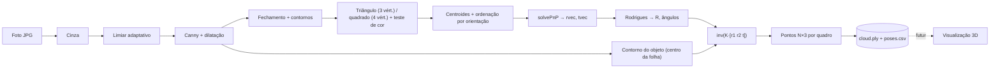

# Reconstrução 3D com OpenCV e Java

Protótipo (2018) para **reconstruir objetos em 3D a partir de fotos tiradas ao redor deles**, usando apenas uma câmera comum e uma folha A4 impressa com um marcador de referência. A primeira versão foi feita em Java no Eclipse (Linux) com OpenCV 2.4, pensando em rodar depois em Android. Hoje o repositório é **um único projeto Maven** (Java 21, OpenCV 4.9) que roda no macOS, incluindo Apple Silicon.

<p align="center">
  
  
</p>
<p align="center"><em>Saída real do projeto unificado em dois quadros com ~180° de diferença: T0/S0/T1/S1 são os marcadores identificados, o retângulo verde é o modelo reprojetado com a pose estimada, e os eixos são X (vermelho), Y (verde) e Z (azul, para cima da folha).</em></p>

> **Status:** protótipo de pesquisa. O pipeline roda de ponta a ponta e grava `poses.csv` e `cloud.ply`, mas a **nuvem de pontos ainda não é geometricamente confiável** (contornos fragmentados, projeção de um plano só) e **não há visualizador 3D** (será acrescentado depois com uma biblioteca Java moderna). Veja [O que funciona e o que não funciona](#o-que-funciona-e-o-que-não-funciona).

## Sumário

1. [A ideia](#a-ideia)
2. [O marcador](#o-marcador)
3. [Pipeline](#pipeline)
4. [Fundamentos: câmera, calibração e pose](#fundamentos-câmera-calibração-e-pose)
5. [De pixels para pontos 3D](#de-pixels-para-pontos-3d)
6. [O que funciona e o que não funciona](#o-que-funciona-e-o-que-não-funciona)
7. [Do legado ao projeto unificado](#do-legado-ao-projeto-unificado)
8. [Estrutura do repositório](#estrutura-do-repositório)
9. [Como executar](#como-executar)
10. [Próximos passos](#próximos-passos)
11. [Skills para o Claude Code](#skills-para-o-claude-code)

## A ideia

Um objeto é colocado no centro de uma folha A4. A câmera dá uma volta de **360°** ao redor dele, capturando um quadro a cada poucos graus. Em cada quadro:

1. o **marcador** impresso na folha revela onde a câmera está e para onde aponta (a *pose*);
2. o **contorno do objeto** é isolado;
3. cada pixel do contorno, sabendo a pose, é convertido em coordenadas reais (mm);
4. os pontos de todos os quadros, juntos, formariam uma **nuvem de pontos 3D**.

Na taxonomia de técnicas de aquisição 3D, isto é uma técnica **óptica passiva** (uma câmera, sem projetar luz) e, na prática, uma variação de *Shape from Silhouette*: o modelo vem dos contornos vistos de vários ângulos.

<p align="center"></p>

## O marcador

O marcador são **2 triângulos e 2 quadrados pretos (≈ 2 × 2 cm)** nos cantos de uma folha A4 em paisagem, com o objeto no centro. O gabarito usado está em [`docs/img/imagem-base-referencia-coordenada.png`](docs/img/imagem-base-referencia-coordenada.png) (3508×2480 px = A4 a 300 dpi); o diagrama polar de 0° a 360° no meio serve de referência para o ângulo de cada foto.

<p align="center">
  
  
</p>

Os quatro centros são os pontos de correspondência 3D↔2D do `solvePnP`. O código assume o plano da folha como `Z = 0`, com os triângulos na coluna esquerda e os quadrados na direita:

```text
   tri0 (0, 0)      ────── 187 mm ──────   sq0 (187, 0)
        │                                       │
      161 mm                                  161 mm
        │                                       │
   tri1 (0, 161)    ────── 187 mm ──────   sq1 (187, 161)
```

Conferi as medidas sobre o gabarito (A4 = 297 × 210 mm): usando o centroide dos triângulos, o espaçamento horizontal dá ≈ 185 mm e o vertical ≈ 160 mm, coerente com os 187 × 161 mm do modelo. (O centro do círculo mínimo, usado no código antigo, cai no meio da hipotenusa e daria ≈ 178 mm.)

## Pipeline



| Etapa | Método OpenCV | Classe |
| --- | --- | --- |
| Bordas | `cvtColor` → `adaptiveThreshold` (MEAN) → `Canny` → `dilate` | [`MarkerDetector.edges`](src/main/java/scan3d/MarkerDetector.java) |
| Formas | `morphologyEx(CLOSE)` → `findContours` → `approxPolyDP` → `isContourConvex` + teste escuro/claro | `MarkerDetector.detect` |
| Centros e ordem | `moments` (centroide) e produto vetorial | `MarkerDetector.order` |
| Pose | `Calib3d.solvePnP`, `projectPoints` (erro), `Rodrigues` | [`PoseEstimator`](src/main/java/scan3d/PoseEstimator.java) |
| Contorno do objeto | `findContours` + regra do "centro da folha" + `drawContours` | [`ObjectContour`](src/main/java/scan3d/ObjectContour.java) |
| Pixel → 3D | `K·[r1 r2 t]`, inversa, coordenadas esféricas | [`PointCloudBuilder`](src/main/java/scan3d/PointCloudBuilder.java) |
| Saída | PLY ASCII, CSV, imagens | [`PlyWriter`](src/main/java/scan3d/PlyWriter.java), [`Pipeline`](src/main/java/scan3d/Pipeline.java) |
| Calibração | `findChessboardCorners` → `calibrateCamera` | [`Calibrator`](src/main/java/scan3d/Calibrator.java) |

<p align="center"></p>
<p align="center"><em>Ilustração genérica da sequência cor → cinza → bordas (figura de referência, não é saída do projeto).</em></p>

**Detecção do marcador.** A ordem `tri0, sq0, tri1, sq1` não vem mais da enumeração dos contornos. Em uma volta de 360° o marcador aparece em qualquer rotação (na metade da volta os quadrados ficam à esquerda), então o código usa a orientação: como a câmera vê a folha de cima, o produto vetorial entre o eixo triângulo→quadrado e o eixo entre as duas formas iguais tem sinal fixo, o que identifica qual é a "0" e qual é a "1". Quadros em que os quatro marcadores não são detectados são **descartados**, não adivinhados.

**A "máscara" é um contorno, não uma região preenchida.** [`ObjectContour`](src/main/java/scan3d/ObjectContour.java) escolhe um contorno da imagem de bordas, desenha-o com espessura 4 em branco e 1 em preto e faz `bitwise_and` com as bordas. O original escolhia o *maior* contorno, e um marcador (anel fechado) podia vencer o objeto; agora o candidato precisa ter o centro da folha dentro do seu retângulo envolvente e nenhum marcador dentro dele.

<p align="center"></p>
<p align="center"><em>Conceito de máscara (imagem genérica; a saída real é a silhueta fina em <code>output/contours</code>).</em></p>

## Fundamentos: câmera, calibração e pose

### Modelo pinhole

<p align="center">
  
  
</p>

Um ponto 3D `(X, Y, Z)` projeta-se no pixel `(u, v)` por:

```text
s · [u v 1]ᵀ = K · [R | t] · [X Y Z 1]ᵀ

        [ fx   0  cx ]
    K = [  0  fy  cy ]      intrínsecos: dependem só da câmera/lente
        [  0   0   1 ]

    [R | t]                 extrínsecos: dependem da posição da câmera em cada foto
```

- `fx, fy`: distância focal em **pixels**; `(cx, cy)`: ponto principal (em geral o centro da imagem).
- Se a imagem for redimensionada, `fx, fy, cx, cy` mudam na mesma proporção.

<p align="center">
  
  
</p>

Pela semelhança de triângulos, com `P` a largura em pixels, `W` a largura real e `D` a distância, vale `F = (P · D) / W`. Serve para estimar uma distância isolada, mas **não substitui o `solvePnP`**, que usa vários pontos e devolve a pose completa.

### Intrínsecos: `TextMatrix.txt`

Os valores vêm de uma calibração com tabuleiro de xadrez feita em 2018 (tabuleiro 8×6, quadrados de 50 mm, `CALIB_FIX_PRINCIPAL_POINT`). O código original só imprimia a matriz e os números foram copiados à mão para a única linha do arquivo. Ele foi portado para o comando `calibrate` (veja [Como executar](#como-executar)), que agora grava o arquivo sozinho e, no formato de 11 valores, guarda também a resolução da calibração:

```text
fx, 0, cx, 0, fy, cy, 0, 0, 1
378.8464, 0, 175.5, 0, 378.8464, 143.5, 0, 0, 1                 (original, 9 valores)
fx, 0, cx, 0, fy, cy, 0, 0, 1, largura, altura                   (novo, 11 valores)
```

<p align="center"></p>
<p align="center"><em><code>circles_pattern.png</code>: padrão alternativo de calibração (grade de círculos) que consta em <code>docs/img</code>; o código usa tabuleiro de xadrez.</em></p>

> ⚠️ **Resolução inconsistente.** `cx = 175.5` e `cy = 143.5` correspondem ao centro de uma imagem de ~351 × 287 px, e a calibração fixou o ponto principal nesse centro. As fotos de `in/` têm **800 × 480** (proporção diferente, 1,67 contra 1,22). Medido no projeto unificado sobre os 72 quadros em que os marcadores foram detectados: com o `TextMatrix.txt` original o erro de reprojeção mediano é **26 px** (máximo 47 px); com uma câmera aproximada (`--approx-camera`: `f` = largura da imagem, ponto principal no centro) cai para **1,2 px**. Por isso o programa avisa quando `K` não combina com a resolução das fotos, e o passo mais importante antes dos testes práticos é recalibrar na resolução real da câmera.

No código antigo, `readMatCamTxt` e os métodos `paramExtrinseco`/`paramIntrinseco` tinham os nomes trocados (o arquivo contém os **intrínsecos**). No projeto unificado os nomes foram corrigidos.

### Extrínsecos: `solvePnP`

<p align="center"></p>

Para cada foto, `solvePnP(objectPoints, imagePoints, K, distCoeffs)` (em [`PoseEstimator`](src/main/java/scan3d/PoseEstimator.java)) recebe:

- `objectPoints`: os 4 centros do marcador no mundo, em mm, com `Z = 0` (tabela acima);
- `imagePoints`: os 4 centros detectados, em pixels;
- `distCoeffs`: hoje **zeros**, ou seja, ignora a distorção da lente.

Devolve `rvec` (rotação, vetor de Rodrigues) e `tvec` (translação, mm): o **extrínseco daquele quadro**. `Calib3d.Rodrigues(rvec)` converte `rvec` em matriz `R` 3×3.

<p align="center">
  
  
</p>
<p align="center"><em>Direita: exemplo de terceiros de pose estimada e reprojeção (arquivo <code>detectacao-objeto-retangular.png</code>). O projeto unificado faz algo parecido em <code>output/annotated</code>, desenhando a moldura do modelo e os eixos sobre a folha.</em></p>

### Ângulos

`PoseEstimator` extrai ângulos de Euler (convenção Z-Y-X) de `R`; `PointCloudBuilder` usa `θ = rz` (o *roll*) e `φ = |ry|` (o *pitch*) como coordenadas esféricas.

<p align="center">
  
  
</p>

## De pixels para pontos 3D

<p align="center"></p>

No [`PointCloudBuilder`](src/main/java/scan3d/PointCloudBuilder.java), cada pixel claro do contorno `(k, j)` faz:

1. `M = inv(K · [r1 r2 t])`, em que `r1, r2` são as duas primeiras colunas de `R` (a terceira, correspondente a `Z`, desaparece porque `Z = 0` no plano da folha);
2. `[a, b, c]ᵀ = M · [k, j, 1]ᵀ`, e então `a/c` e `b/c` são as coordenadas `(X, Y)` **sobre o plano da folha**;
3. `raio = b/c` vira `r` em coordenadas esféricas, com `theta` e `phi` da pose:

```text
x = r · sin θ · sin φ
y = r · cos θ · sin φ
z = r · cos φ
```

O resultado, por quadro, vai para `cloud.ply` (com o índice do quadro). A fórmula foi mantida como no original, com duas correções: os ângulos eram passados em **graus** para `Math.sin/cos` (que esperam radianos) e `θ` negativo era ajustado com `360 - θ` em vez de `360 + θ`. Duas observações sobre a matemática:

- O passo 2 é uma **homografia plano→imagem**, correta só para pontos que estão *no plano da folha*. Um ponto do contorno do objeto está acima da folha, então uma única vista o projeta no ponto errado; a triangulação entre vários quadros (a intenção original do projeto) é que resolveria isso.
- `rho = a/c` (o `X` no plano) é calculado e **descartado**: só `Y` entra na conversão esférica.

<p align="center"></p>

Esta figura e a abaixo mostram o **resultado esperado**, retirado de material de terceiros; não foram geradas por este código.

<p align="center"></p>

## O que funciona e o que não funciona

Resultado de `./scan3d.sh scan --approx-camera` sobre as 129 fotos de `in/`:

| Etapa | Estado |
| --- | --- |
| Detecção dos 2 quadrados + 2 triângulos | ✅ **72 de 129** quadros (56%) |
| Identificação e ordem dos marcadores | ✅ consistente nos dois lados da volta (testado com 24 rotações sintéticas e conferido visualmente) |
| Pose com `solvePnP` | ✅ erro de reprojeção mediano 1,2 px (com `K` aproximada); ⚠️ 26 px com o `TextMatrix.txt` original |
| Contorno do objeto | ⚠️ localizado no objeto nos 72 quadros, mas **fragmentado** (a imagem de bordas quebra o contorno do pote) |
| Nuvem de pontos | ⚠️ gerada e gravada (`cloud.ply`, ~12,8 mil pontos), mas **não confiável**: `z` varia de −791 a +376 mm para um pote de cerca de 10 cm, porque a projeção usa um único plano e o contorno é fragmentado |
| Volta de 360° | ✅ o ângulo `rz` da pose cobre −179° a +180° |
| Visualização 3D | ❌ ainda não; será acrescentada depois com uma biblioteca Java moderna |

Os 57 quadros descartados (44%) têm sempre 3 marcadores ou menos, e o que falta quase sempre é o **triângulo do lado de trás**: escondido pelo próprio objeto, pequeno e borrado demais, ou cortado pela borda da foto. É um limite da configuração (o objeto oculta parte do marcador), não só do detector. Com 3 marcadores não dá para saber qual falta, então o quadro é ignorado.

Limitações e pontos de atenção:

- **`K` de 2018 não combina com as fotos** (calibrada para ~351 × 287, fotos de 800 × 480). Use `--approx-camera` nas fotos de exemplo e recalibre para os testes práticos.
- **Distorção da lente ignorada** (`distCoeffs` = 0). O `calibrate` imprime os coeficientes, mas o pipeline ainda não os usa.
- **A conversão pixel → 3D é uma homografia do plano da folha.** Pontos do objeto acima da folha caem no lugar errado com uma única vista. A solução de fato é cruzar silhuetas de vários quadros (*visual hull*) ou triangular.
- **Só a coordenada `Y` do plano entra na fórmula esférica** (`X` é calculado e descartado, como no original). Confirme se essa era a intenção.
- **Sem GUI nem visualizador.** A saída é `cloud.ply`, que abre em MeshLab ou CloudCompare.

## Do legado ao projeto unificado

Os antigos `Example01` e `Example02` viraram um projeto único, com o **Example02 como base** por ser o mais próximo do objetivo (pose + contorno + nuvem de pontos). Do Example01 vieram a validação rígida de 2+2 marcadores e a ideia de desenhar a pose sobre a foto (`project3d`). O histórico dos dois continua no git.

| Legado | Unificado |
| --- | --- |
| `MainActivity` (caminho fixo `/home/jose/...`) | [`Main`](src/main/java/scan3d/Main.java) com `--in`, `--out`, `--camera`, `--approx-camera`, `--limit` |
| `imgproc1` + `findObjects` + `storesCentroid` | [`MarkerDetector`](src/main/java/scan3d/MarkerDetector.java) |
| `calcSolvepnp` (rvec/tvec descartados) | [`PoseEstimator`](src/main/java/scan3d/PoseEstimator.java) → `Pose`, gravada em `poses.csv` |
| `maskImage` (comentada) | [`ObjectContour`](src/main/java/scan3d/ObjectContour.java) |
| `PointsObjectInFrame` (Jama, `println`) | [`PointCloudBuilder`](src/main/java/scan3d/PointCloudBuilder.java) (OpenCV, sem Jama) + [`PlyWriter`](src/main/java/scan3d/PlyWriter.java) |
| `CalibChessBoard.java~` (backup, sem uso) | [`Calibrator`](src/main/java/scan3d/Calibrator.java), comando `calibrate` |
| `Highgui`, `Core.circle/line/putText` (OpenCV 2.4) | `Imgcodecs`, `Imgproc.*` (OpenCV 4.9) |
| Classes JOGL (`MainCvinGL`, `OpenCVImageInGL`, `OpenCVGLTexture`) | **Removidas.** A visualização será refeita depois com outra biblioteca |

Correções feitas no caminho, além de fazer o fluxo funcionar de ponta a ponta:

| Problema no legado | O que mudou |
| --- | --- |
| `listSquares.size() >= 0` sempre verdadeiro; `.get(1)` quebrava | exige exatamente 2 triângulos e 2 quadrados; senão descarta o quadro e informa o motivo |
| Ordem dos marcadores dependia da enumeração de contornos | ordenação por orientação (produto vetorial), válida em qualquer rotação da folha |
| Ex.01 e Ex.02 com modelos 161×187 e 187×161 mm | um só modelo, 187 (X) × 161 (Y); confere com o gabarito |
| `project3d` misturava `x` do quadrado 0 com `y` do quadrado 1 | não foi portado; a sobreposição usa os pontos corretos |
| Centro de cada forma por `minEnclosingCircle`, que num triângulo retângulo cai no meio da hipotenusa | centroide por momentos. No gabarito dá ≈185 mm de espaçamento horizontal (a hipotenusa daria ≈178 mm) contra os 187 mm do modelo |
| Triângulos finos em perspectiva eram rejeitados (razão de áreas) e fundo/código de barras eram aceitos | 3 vértices = triângulo, 4 = quadrado, fechamento morfológico das bordas e teste "escuro por dentro, claro ao redor" |
| "Maior contorno" podia ser um marcador | regra do centro da folha (veja [Pipeline](#pipeline)) |
| Ângulos em graus passados a `Math.sin/cos`; `360 - θ` para θ < 0 | radianos; `360 + θ` |
| Contagem de pixels com `> 150`, preenchimento com `> 200` | um só limiar (200), sem linhas zeradas |
| `readMatCamTxt` lia só a última linha; exigia exatamente 9 valores | lê a última linha não vazia; aceita 9 ou 11 valores |

## Estrutura do repositório

| Caminho | Conteúdo |
| --- | --- |
| [`pom.xml`](pom.xml) | Projeto Maven: Java 21, `org.openpnp:opencv` 4.9 (traz as bibliotecas nativas), JUnit 5 |
| [`src/main/java/scan3d`](src/main/java/scan3d) | Código: detector, pose, contorno, nuvem, PLY, calibração, CLI |
| [`src/test/java/scan3d`](src/test/java/scan3d) | Testes automatizados |
| [`scan3d.sh`](scan3d.sh) | Compila se preciso e executa (escolhe o JDK 21 do Homebrew) |
| [`in/800x480 com objeto`](in/800x480%20com%20objeto) | 129 fotos de teste (JPG 800×480) de um pote sobre a folha |
| [`out/`](out) | 10 saídas históricas de 2018 (`*.matMask.jpg`). **Não é** a saída do programa atual |
| `output/` | Saída do programa atual (ignorada pelo git) |
| [`docs/img`](docs/img) | Figuras usadas neste README |
| [`TextMatrix.txt`](TextMatrix.txt) | Matriz intrínseca original (9 valores, calibrada em outra resolução) |
| [`lib/`](lib) | Legado: `opencv-2413.jar` e `.so` de Linux do OpenCV 2.4. **Não é mais usado** |
| [`install-linux.md`](install-linux.md) | Passo a passo histórico (Ubuntu 16.04, Eclipse Luna, OpenCV 2.4) |
| [`.claude/skills`](.claude/skills) | Skills para o Claude Code |

## Como executar

### Instalação no macOS (feita e testada neste Mac, Apple Silicon)

```bash
brew install openjdk@21 maven
```

O OpenCV **não precisa ser instalado**: o pacote Maven `org.openpnp:opencv` traz a biblioteca nativa (inclusive para macOS ARM64) e o programa a extrai sozinho. O JDK 21 do Homebrew é *keg-only*, então o `scan3d.sh` já o localiza; para usá-lo no terminal:

```bash
echo 'export JAVA_HOME=/opt/homebrew/opt/openjdk@21' >> ~/.zshrc
```

Nada foi alterado no `~/.zshrc` automaticamente.

### Executar

```bash
./scan3d.sh scan --approx-camera          # fotos de exemplo, K aproximada; saída em output/
./scan3d.sh scan --in MINHA_PASTA --camera MINHA_CAMERA.txt --out output/teste1
./scan3d.sh calibrate --in FOTOS_TABULEIRO --pattern 8x6 --square 50   # grava TextMatrix.txt
./scan3d.sh --help
```

O primeiro `scan3d.sh` compila (baixa dependências e gera um jar de ~110 MB, pois embute as bibliotecas nativas de todos os sistemas). Saída de `scan`:

| Arquivo | Conteúdo |
| --- | --- |
| `output/annotated/*.jpg` | foto com marcadores, IDs, moldura do modelo e eixos da pose |
| `output/contours/*.png` | contorno do objeto |
| `output/poses.csv` | por quadro: `tx, ty, tz` (mm), `rx, ry, rz` (graus), erro de reprojeção (px), nº de pontos |
| `output/cloud.ply` | nuvem acumulada, com a propriedade `frame` |

O erro de reprojeção (`reproj_rms_px`) é o melhor indicador rápido: valores de poucos pixels indicam marcadores certos e `K` coerente; dezenas de pixels indicam `K` errada.

### Para os testes práticos

1. Fotografe um **tabuleiro de xadrez** impresso (ex.: 8×6 cantos internos, quadrados de 50 mm) em 15 ou mais posições, **na mesma resolução** que usará para o objeto, e rode `calibrate`.
2. Imprima o gabarito ([`docs/img/imagem-base-referencia-coordenada.png`](docs/img/imagem-base-referencia-coordenada.png)) em A4 **sem escala/ajuste de página** e confira com régua os 187 × 161 mm entre os centros dos marcadores; se diferir, altere `WIDTH_MM`/`HEIGHT_MM` em [`PoseEstimator`](src/main/java/scan3d/PoseEstimator.java).
3. Deixe **os quatro marcadores visíveis** em cada foto e o objeto no centro, sem cobrir nenhum marcador.
4. Use luz difusa: sombras e reflexos quebram os contornos.

### Testes

```bash
JAVA_HOME=/opt/homebrew/opt/openjdk@21 mvn test
```

Cobrem: ordenação dos marcadores em 24 rotações, recuperação de uma pose sintética conhecida (erro < 0,01 px), detecção em uma foto real de `in/`, e leitura/escala do arquivo da câmera. O comando `calibrate` **não foi exercitado com fotos reais** (não há fotos de tabuleiro no repositório); só o tratamento de erro sem imagens foi conferido.

## Próximos passos

Em ordem de retorno sobre esforço:

1. **Recalibrar** na resolução real e passar os `distCoeffs` ao `solvePnP` e à inversão.
2. **Segmentar o objeto contra o papel branco** (limiar/GrabCut dentro do quadrilátero dos marcadores) para obter uma silhueta **preenchida**, no lugar do contorno de bordas fragmentado.
3. **Cruzar silhuetas de vários quadros** (*visual hull*) em vez da homografia de plano único; é o que dá a terceira dimensão de verdade.
4. **Tolerar 3 marcadores** ou reposicionar a folha/câmera para reduzir a oclusão pelo objeto (hoje 44% dos quadros são descartados).
5. **Visualizador de nuvem** em Java com uma biblioteca moderna e simples; a entrada já está pronta em `cloud.ply`.
6. Portar para Android (OpenCV Android + a mesma lógica), depois de validar a matemática.

## Skills para o Claude Code

Em [`.claude/skills`](.claude/skills) há skills que carregam este contexto sob demanda:

| Skill | Use para |
| --- | --- |
| `scan3d-opencv-java` | Visão geral, mapa do código e roteiro de investigação |
| `scan3d-pose-geometry` | Explicar `K`, `[R\|t]`, `solvePnP`, homografia e coordenadas esféricas, e checar a matemática do código |
| `scan3d-legacy-run-port` | Rodar, depurar e evoluir o projeto no macOS; histórico do legado e portabilidade |
