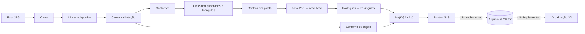
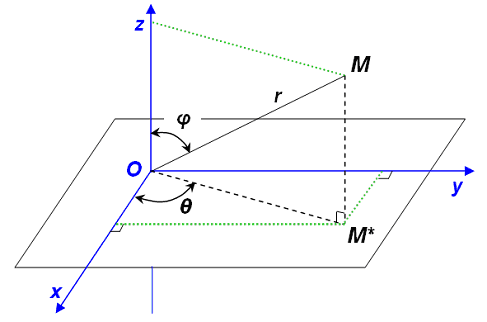

# Reconstrução 3D com OpenCV e Java

Protótipo (2018) para **reconstruir objetos em 3D a partir de fotos tiradas ao redor deles**, usando apenas uma câmera comum e uma folha A4 impressa com um marcador de referência. A ideia era rodar em Android; a primeira versão foi feita em Java "puro" no Eclipse (Linux) com OpenCV 2.4.

<p align="center">
  
  
</p>
<p align="center"><em>Entrada (<code>in/</code>) e saída (<code>out/</code>) do mesmo quadro: os quatro marcadores ficam na folha; o processamento isola o contorno do objeto.</em></p>

> **Status:** protótipo de pesquisa, **incompleto**. Detecta os marcadores, estima a pose da câmera e isola o contorno do objeto. A **nuvem de pontos 3D não é gravada nem visualizada**. Veja [O que funciona e o que não funciona](#o-que-funciona-e-o-que-não-funciona).

## Sumário

1. [A ideia](#a-ideia)
2. [O marcador](#o-marcador)
3. [Pipeline](#pipeline)
4. [Fundamentos: câmera, calibração e pose](#fundamentos-câmera-calibração-e-pose)
5. [De pixels para pontos 3D](#de-pixels-para-pontos-3d)
6. [O que funciona e o que não funciona](#o-que-funciona-e-o-que-não-funciona)
7. [Example01 × Example02](#example01--example02)
8. [Estrutura do repositório](#estrutura-do-repositório)
9. [Como executar](#como-executar)
10. [Próximos passos](#próximos-passos)
11. [Skills para o Claude Code](#skills-para-o-claude-code)

## A ideia

Um objeto é colocado no centro de uma folha A4. A câmera dá uma volta de **360°** ao redor dele, capturando um quadro a cada poucos graus. Em cada quadro:

1. o **marcador** impresso na folha revela onde a câmera está e para onde aponta (a *pose*);
2. o **contorno do objeto** é isolado;
3. cada pixel do contorno, sabendo a pose, é convertido em coordenadas reais (mm);
4. os pontos de todos os quadros, juntos, formariam uma **nuvem de pontos 3D**.

Na taxonomia de técnicas de aquisição 3D, isto é uma técnica **óptica passiva** (uma câmera, sem projetar luz) e, na prática, uma variação de *Shape from Silhouette*: o modelo vem dos contornos vistos de vários ângulos.

<p align="center"></p>

## O marcador

O marcador são **2 triângulos e 2 quadrados pretos (≈ 2 × 2 cm)** nos cantos de uma folha A4 em paisagem, com o objeto no centro. O gabarito usado está em [`docs/img/imagem-base-referencia-coordenada.png`](docs/img/imagem-base-referencia-coordenada.png) (3508×2480 px = A4 a 300 dpi); o diagrama polar de 0° a 360° no meio serve de referência para o ângulo de cada foto.

<p align="center">
  
  
</p>

Os quatro centros são os pontos de correspondência 3D↔2D do `solvePnP`. O código assume o plano da folha como `Z = 0`, com os triângulos na coluna esquerda e os quadrados na direita:

```text
   tri0 (0, 0)      ────── 187 mm ──────   sq0 (187, 0)
        │                                       │
      161 mm                                  161 mm
        │                                       │
   tri1 (0, 161)    ────── 187 mm ──────   sq1 (187, 161)
```

Conferi as medidas sobre o gabarito (A4 = 297 × 210 mm): o espaçamento horizontal dá ≈ 189 mm e o vertical ≈ 160 mm, coerente com 187 × 161 mm do Example02.

## Pipeline



| Etapa | Método OpenCV | Onde |
| --- | --- | --- |
| Ler imagens | `Highgui.imread` | `processImages` |
| Bordas | `cvtColor` → `adaptiveThreshold` → `Canny` → `dilate` | `imgproc1` (Ex.02) / `imgproc` (Ex.01) |
| Formas | `findContours` → `approxPolyDP` → `contourArea`, `minEnclosingCircle`, `minAreaRect` | `findObjects` |
| Centros | `minEnclosingCircle` de cada forma aceita | `storesCentroid` |
| Pose | `Calib3d.solvePnP` | `calcSolvepnp` (Ex.02) / `project3d` (Ex.01) |
| Contorno do objeto | maior contorno por área + `drawContours` | `maskImage` |
| Pixel → mundo | `Rodrigues`, inversa de `K[R\|t]` (Jama) | `PointsObjectInFrame` |

<p align="center"></p>
<p align="center"><em>Ilustração genérica da sequência cor → cinza → bordas (figura de referência, não é saída do projeto).</em></p>

**A "máscara" é um contorno, não uma região preenchida.** `maskImage` escolhe o maior contorno da imagem de bordas, desenha-o com espessura 4 em branco e 1 em preto e faz `bitwise_and` com a imagem de bordas. O resultado é a silhueta fina vista em `out/`. Repare também nos pequenos fragmentos soltos (à esquerda do pote na imagem de saída): eles são ruído que passou pelo filtro e entraria na nuvem.

<p align="center"></p>
<p align="center"><em>Conceito de máscara (imagem genérica; a máscara real do projeto é o contorno mostrado no topo).</em></p>

## Fundamentos: câmera, calibração e pose

### Modelo pinhole

<p align="center">
  
  
</p>

Um ponto 3D `(X, Y, Z)` projeta-se no pixel `(u, v)` por:

```text
s · [u v 1]ᵀ = K · [R | t] · [X Y Z 1]ᵀ

        [ fx   0  cx ]
    K = [  0  fy  cy ]      intrínsecos: dependem só da câmera/lente
        [  0   0   1 ]

    [R | t]                 extrínsecos: dependem da posição da câmera em cada foto
```

- `fx, fy`: distância focal em **pixels**; `(cx, cy)`: ponto principal (em geral o centro da imagem).
- Se a imagem for redimensionada, `fx, fy, cx, cy` mudam na mesma proporção.

<p align="center">
  
  
</p>

Pela semelhança de triângulos, com `P` a largura em pixels, `W` a largura real e `D` a distância, vale `F = (P · D) / W`. Serve para estimar uma distância isolada, mas **não substitui o `solvePnP`**, que usa vários pontos e devolve a pose completa.

### Intrínsecos: `TextMatrix.txt`

Os valores vêm de uma calibração com tabuleiro de xadrez, cujo código sobrou em `CalibChessBoard.java~` (tabuleiro 8×6, quadrados de 50 mm, `CALIB_FIX_PRINCIPAL_POINT`). Ele só imprime a matriz; os números foram copiados à mão para a única linha do arquivo:

```text
fx, 0, cx, 0, fy, cy, 0, 0, 1
378.8464, 0, 175.5, 0, 378.8464, 143.5, 0, 0, 1
```

<p align="center"></p>
<p align="center"><em><code>circles_pattern.png</code>: padrão alternativo de calibração (grade de círculos) que consta em <code>docs/img</code>; o código que sobrou usa tabuleiro de xadrez.</em></p>

> ⚠️ **Resolução inconsistente.** `cx = 175.5` e `cy = 143.5` correspondem ao centro de uma imagem de ~351 × 287 px, e a calibração fixou o ponto principal nesse centro. As fotos de `in/` têm **800 × 480** (proporção diferente, 1,67 contra 1,22). Sem recalibrar nessa resolução ou pelo menos reescalar `K`, a pose e a inversão de projeção saem distorcidas. É, provavelmente, a maior fonte de erro numérico do protótipo.

O nome `readMatCamTxt` e alguns comentários dizem "extrínseco", mas o arquivo contém os **intrínsecos**. No `PointsObjectInFrame`, os nomes dos métodos também estão trocados: `paramExtrinseco(cameraMat)` recebe a matriz **intrínseca** e `paramIntrinseco(rvec, tvec)` recebe os **extrínsecos**.

### Extrínsecos: `solvePnP`

<p align="center"></p>

Para cada foto, `solvePnP(objectPoints, imagePoints, K, distCoeffs)` recebe:

- `objectPoints`: os 4 centros do marcador no mundo, em mm, com `Z = 0` (tabela acima);
- `imagePoints`: os 4 centros detectados, em pixels;
- `distCoeffs`: hoje **zeros**, ou seja, ignora a distorção da lente.

Devolve `rvec` (rotação, vetor de Rodrigues) e `tvec` (translação, mm): o **extrínseco daquele quadro**. `Calib3d.Rodrigues(rvec)` converte `rvec` em matriz `R` 3×3.

<p align="center">
  
  
</p>
<p align="center"><em>Direita: exemplo de terceiros de pose estimada e reprojeção (arquivo <code>detectacao-objeto-retangular.png</code>). É o que o <code>project3d</code> do Example01 pretende fazer, desenhando um cubo sobre a folha.</em></p>

### Ângulos

`PointsObjectInFrame.calcAngle` extrai ângulos de Euler (Tait-Bryan) de `R`, com `theta` a partir do *roll* e `phi` a partir do *pitch*, para usá-los como coordenadas esféricas.

<p align="center">
  
  
</p>

## De pixels para pontos 3D

<p align="center"></p>

No `PointsObjectInFrame`, cada pixel claro do contorno `(k, j)` faz:

1. `M = inv(K · [r1 r2 t])`, em que `r1, r2` são as duas primeiras colunas de `R` (a terceira, correspondente a `Z`, desaparece porque `Z = 0` no plano da folha);
2. `[a, b, c]ᵀ = M · [k, j, 1]ᵀ`, e então `a/c` e `b/c` são as coordenadas `(X, Y)` **sobre o plano da folha**;
3. `raio = b/c` vira `r` em coordenadas esféricas, com `theta` e `phi` da pose:

```text
x = r · sin θ · sin φ
y = r · cos θ · sin φ
z = r · cos φ
```

O resultado é impresso como matriz `N × 3`. Duas observações sobre a matemática:

- O passo 2 é uma **homografia plano→imagem**, correta só para pontos que estão *no plano da folha*. Um ponto do contorno do objeto está acima da folha, então uma única vista o projeta no ponto errado; a triangulação entre vários quadros (a intenção original do projeto) é que resolveria isso.
- `rho = a/c` (o `X` no plano) é calculado e **descartado**: só `Y` entra na conversão esférica.

<p align="center"></p>

Esta figura e a abaixo mostram o **resultado esperado**, retirado de material de terceiros; não foram geradas por este código.

<p align="center"></p>

## O que funciona e o que não funciona

| Etapa | Estado |
| --- | --- |
| Detecção dos 2 quadrados + 2 triângulos | ✅ funciona nas amostras (Example01 exige exatamente 2+2; Example02 é mais tolerante) |
| Centros e IDs desenhados na imagem | ✅ `storesCentroid` |
| Calibração da câmera | ⚠️ feita uma vez em outra resolução; código só em `CalibChessBoard.java~` |
| Pose com `solvePnP` | ⚠️ calculada, mas no Example02 `rvec`/`tvec` ficam em variáveis locais e são descartados |
| Contorno do objeto (`maskImage`) | ⚠️ implementado, **chamada comentada** no fluxo principal dos dois exemplos |
| Pixel → 3D (`PointsObjectInFrame`) | ⚠️ implementado, mas nada o alimenta (`paramIntrinseco`/`paramExtrinseco` comentados) |
| Gravar nuvem em arquivo | ❌ só `System.out.println` |
| Acumular quadros / 360° | ❌ não implementado |
| Visualização 3D | ❌ JOGL só desenha um teste; não recebe a nuvem, e os jars JOGL não estão no repositório |

Problemas de código conhecidos, todos verificados na leitura:

| Onde | Problema |
| --- | --- |
| Ex.02 `MainActivity.processImages` | `listSquares.size() >= 0 && listTriangles.size() >= 0` é sempre verdadeiro; `calcSolvepnp` acessa `.get(1)` e lança exceção com menos de 2+2 formas |
| Ex.02 `calcSolvepnp` | A ordem dos pontos assume `tri0, sq0, tri1, sq1`, mas a ordem real vem da enumeração de contornos do OpenCV, sem garantia |
| Ex.01 `project3d` | `new Point(centerSquare.get(0).center.x, centerSquare.get(1).center.y)`: mistura `x` do quadrado 0 com `y` do quadrado 1 |
| Ex.01 × Ex.02 | Modelos 3D diferentes: 161 × 187 mm (Ex.01) e 187 × 161 mm (Ex.02), com outra ordem de pontos. Pelo gabarito, 187 mm é a distância horizontal |
| `PointsObjectInFrame.pointCloudConstruction` | Conta pixels com limiar `> 150` mas preenche com `> 200`: sobram linhas `(0,0,0)` no final da matriz |
| `PointsObjectInFrame.calcAngle` | `if (theta1 < 0) theta1 = 360 - theta1;` dá 390° para −30°; o correto seria `360 + theta1` |
| `readMatCamTxt` | Só lê a **última** linha do arquivo |
| `.classpath` | Caminhos absolutos de `/home/jose/...` (incluindo `OpenGl_test/lib`, que não está mais aqui) |

## Example01 × Example02

| | [`Example01`](projects/OpenCv-Java-Example01) | [`Example02`](projects/OpenCv-Java-Example02) |
| --- | --- | --- |
| Limiarização | `ADAPTIVE_THRESH_GAUSSIAN_C`, bloco 11 | `ADAPTIVE_THRESH_MEAN_C`, bloco 15, depois `Canny` |
| Formas aceitas | triângulo = 3 vértices, quadrado = 4; áreas e razões mais estritas | 3 a 8 vértices; classifica por área em relação ao `minAreaRect` |
| Validação | só segue com **exatamente** 2 quadrados e 2 triângulos | sem validação efetiva (ver acima) |
| Saída ativa | grava foto anotada em `out/` (`*.G(11, 5)-D(2, 2).jpg`) | nenhuma (todos os `imwrite` comentados) |
| Pose | `project3d` (desenha cubo com `projectPoints`), **comentado** | `calcSolvepnp`, ativo mas sem destino |
| Nuvem de pontos | não tem | `PointsObjectInFrame` (Jama), desconectado |
| Extras | | 3 classes JOGL (`MainCvinGL`, `OpenCVImageInGL`, `OpenCVGLTexture`) |

## Estrutura do repositório

| Caminho | Conteúdo |
| --- | --- |
| [`projects/OpenCv-Java-Example01`](projects/OpenCv-Java-Example01) | Primeiro pipeline: detecção dos marcadores e projeção de um cubo |
| [`projects/OpenCv-Java-Example02`](projects/OpenCv-Java-Example02) | Versão mais avançada: pose, contorno, protótipo de nuvem de pontos, JOGL |
| [`in/800x480 com objeto`](in/800x480%20com%20objeto) | 129 fotos de teste (JPG 800×480) de um pote sobre a folha |
| [`out/`](out) | 10 saídas de teste (`*.matMask.jpg`, contornos do objeto) |
| [`docs/img`](docs/img) | Figuras usadas neste README |
| [`lib/`](lib) | `opencv-2413.jar` e `libopencv_java2413.so` (Linux) |
| [`TextMatrix.txt`](TextMatrix.txt) | Matriz intrínseca (9 valores em uma linha) |
| [`install-linux.md`](install-linux.md) | Passo a passo histórico (Ubuntu 16.04, Eclipse Luna, OpenCV 2.4) |
| [`.claude/skills`](.claude/skills) | Skills para o Claude Code (ver abaixo) |

Vários arquivos `*.java~` (backups do editor) e `bin/` com `.class` compilados foram mantidos como estavam. `CalibChessBoard.java~` é o único vestígio do código de calibração.

## Como executar

Não há `pom.xml`, `build.gradle` nem testes: o projeto foi feito para Eclipse. Detalhes históricos de instalação em [install-linux.md](install-linux.md).

1. Use **Linux x86-64** com Java 8+ (o `.so` de `lib/` é ELF de Linux, não roda em macOS/Windows/Android).
2. Importe um dos projetos no Eclipse. Coloque `lib/opencv-2413.jar` (e `Jama-1.0.3.jar`, no Example02) no *Build Path* e aponte a *Native library location* para a pasta `lib/` (ou copie o `.so` para o `java.library.path`).
3. Em `test0()` de `MainActivity`, troque `"/home/jose/Documentos/Opencv"` por uma pasta que contenha as fotos `.jpg` **e** o `TextMatrix.txt`. A subpasta `out/` é criada dentro dela.
4. Execute `mainOpenCv.MainActivity` e confira no console o total de quadrados e triângulos.

Para compilar no Example02 é preciso também os jars JOGL/gluegen (`MainCvinGL` e as classes GL); eles saíram do repositório junto com o projeto `OpenGl_test`. Sem eles, exclua essas três classes do build.

**Modernizar/portar** (OpenCV 3/4, macOS ou Android) exige pouco código, mas é uma troca de API:

| OpenCV 2.4 | OpenCV 3/4 |
| --- | --- |
| `Highgui.imread`, `Highgui.imwrite` | `Imgcodecs.imread`, `Imgcodecs.imwrite` |
| `Highgui.CV_LOAD_IMAGE_COLOR` | `Imgcodecs.IMREAD_COLOR` |
| `Core.circle`, `Core.line`, `Core.putText` | `Imgproc.circle`, `Imgproc.line`, `Imgproc.putText` |
| `Core.FONT_HERSHEY_SIMPLEX` | `Imgproc.FONT_HERSHEY_SIMPLEX` |
| `System.loadLibrary(Core.NATIVE_LIBRARY_NAME)` | igual, mas com a `.so`/`.dylib` da versão nova |

> Nenhum destes passos foi executado durante a reescrita deste documento; as afirmações vêm da leitura do código e das imagens.

## Próximos passos

Em ordem de retorno sobre esforço:

1. **Recalibrar** na resolução das fotos (ou reescalar `K`) e usar os `distCoeffs` reais.
2. **Validar 4 marcadores** e ordená-los de forma determinística (por exemplo, triângulos à esquerda, ordenados por `y`) antes de chamar `solvePnP`; receber pasta de entrada/saída por argumento.
3. **Persistir** `rvec`, `tvec`, ângulo do quadro e os pontos (`x,y,z,frame`) em CSV/PLY/XYZ.
4. **Preencher a silhueta** (`drawContours` com `-1` de espessura) e remover fragmentos soltos.
5. **Acumular os quadros** de 360° e **triangular/intersectar silhuetas** em vez de usar a homografia de plano único; o *visual hull* é o caminho natural.
6. Visualizar o PLY/XYZ em uma ferramenta pronta (MeshLab, CloudCompare) e só depois pensar em um visualizador próprio (Three.js, JavaFX 3D ou Open3D em Python).
7. Migrar para OpenCV Android (ou pipeline offline em Python/OpenCV) quando a lógica estiver validada.

## Skills para o Claude Code

Em [`.claude/skills`](.claude/skills) há skills que carregam este contexto sob demanda:

| Skill | Use para |
| --- | --- |
| `scan3d-opencv-java` | Visão geral, mapa do código e roteiro de investigação |
| `scan3d-pose-geometry` | Explicar `K`, `[R\|t]`, `solvePnP`, homografia e coordenadas esféricas, e checar a matemática do código |
| `scan3d-legacy-run-port` | Rodar o projeto antigo, ou portá-lo para OpenCV 4/Android |
